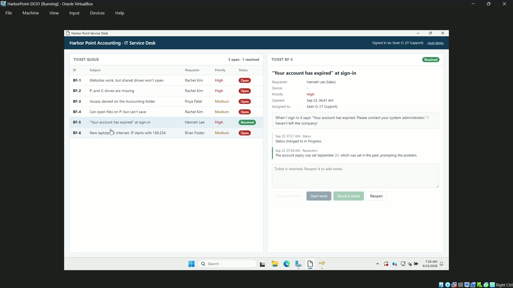
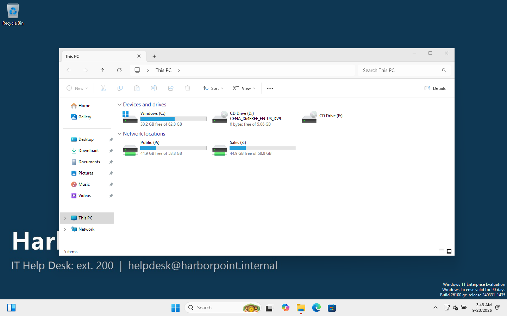

# Windows Active Directory Homelab: "Harbor Point Accounting"

A hands-on lab where I built the IT setup for a fictional **20-person accounting firm** with Windows Server 2025 Active Directory. I then worked through the day-to-day tickets a help desk or junior sysadmin would handle there.

> **About this project:** this is a **learning lab**, not production experience. I built it with AI assistance (Claude) as a guided walkthrough, then studied each step, re-ran it, and documented it in my own words so I can explain and repeat every part of it.


## 🎥 Demo: working a help desk ticket (2:55, with narration)

[](media/helpdesk-demo-bf5.mp4)

**▶ [Watch the video (MP4, 11 MB)](media/helpdesk-demo-bf5.mp4)**

A user reports *"Your account has expired. Please contact your system administrator."* In the video I:
1. pick up the ticket in the service desk queue and mark it In Progress,
2. reproduce the error on the Windows 11 PC,
3. find the cause in Active Directory Users and Computers (an account expiry date set in the past),
4. fix it, confirm the user can sign in again, and resolve the ticket with a note.

The ticket queue is a simple page I use for lab practice, not a commercial product.

## What I built

| Area | What's in the lab |
|---|---|
| **Virtualization** | VirtualBox 7.2, isolated NAT Network, 2 VMs built with an unattended install |
| **Active Directory** | New forest `harborpoint.internal` on Windows Server 2025 |
| **DNS** | AD-integrated zones, reverse lookup zone, forwarders |
| **DHCP** | Scope 10.10.10.100–200 with router/DNS/domain options, authorized in AD |
| **Users & OUs** | 20 staff in 6 department OUs, separate `adm.` accounts in their own OU, Disabled Users OU |
| **Security groups** | AGDLP model: `GG_<Dept>` → `DL_Share_<Dept>` → folder permission |
| **Delegation** | Help desk group can reset passwords/unlock accounts only (least privilege) |
| **File shares** | Per-department shares, NTFS + share permissions, Access-Based Enumeration |
| **Group Policy** | Password/lockout policy, screen lock, logon banner, wallpaper, drive maps with item-level targeting, USB block |
| **Client** | Windows 11 Enterprise joined to the domain, GPOs verified with `gpresult` |
| **Help desk tickets** | 6 tickets worked for real: lockout (traced with event 4740), password reset, new starter, leaver, department move, GPO not applying |
| **PowerShell** | Bulk user import, onboarding, offboarding and stale-account report scripts |

## Network diagram

```
                        Internet
                           │
                 ┌─────────┴─────────┐
                 │  VirtualBox NAT   │  gateway 10.10.10.1
                 │  "HarborNet"      │  10.10.10.0/24 (isolated from home LAN)
                 └───┬───────────┬───┘
                     │           │
          ┌──────────┴───┐   ┌───┴──────────────┐
          │ DC01         │   │ WS01             │
          │ 10.10.10.10  │   │ DHCP .100-.200   │
          │ Server 2025  │   │ Windows 11 Ent.  │
          │ AD DS · DNS  │   │ domain member    │
          │ DHCP · Files │   │                  │
          └──────────────┘   └──────────────────┘
```

## The company

**Harbor Point Accounting**: 20 staff, one office.

| Department | Staff | Share | Notes |
|---|---|---|---|
| Management | 2 | `\\DC01\Management` | |
| Accounting | 6 | `\\DC01\Accounting` | |
| Sales | 5 | `\\DC01\Sales` | USB storage blocked |
| Operations | 4 | `\\DC01\Operations` | |
| HR | 1 | `\\DC01\HR` | |
| IT | 2 | `\\DC01\IT` | separate `adm.` admin accounts |

Everyone gets `P:` → `\\DC01\Public`, plus `S:` → their own department share.

## What an employee sees

Rachel Kim (Sales Manager) signs in to the Windows 11 PC: company wallpaper, `P:` and `S:` drives mapped by group, Accounting share denied, Registry Editor blocked. All of it comes from Active Directory and Group Policy.

| Mapped drives | Verification as Rachel |
|---|---|
|  |  |

## Things that broke, and how I fixed them

The most useful part of the lab. Full details are in [doc 11](docs/11-troubleshooting-and-lessons.md).

- **New DC stuck on "Applying computer settings".** SYSVOL never initialised (DFSR event 1202, `SysvolReady = 0`). Restarting DFSR fixed it (event 4602).
- **DC clock 9 minutes slow**, enough to break Kerberos. Pointed the PDC Emulator at external NTP.
- **Help desk could reset a Domain Admin's password.** Admin accounts were inside the delegated OU. Moved them to their own OU and re-tested: *Access denied*.
- **"Complex" password rejected.** It contained the user's first name, which the complexity rule forbids.
- **Server Manager all red.** A restart was pending. Found it in the ServerManager event log.
- **I was wrong about Access-Based Enumeration.** It hides files *inside* shares, not share names. Corrected after testing.

## Step-by-step documentation

Read them in order. Each page follows the same layout: **Goal → Why a company does this → GUI steps → PowerShell → Verify → Common mistakes → Interview questions**.

| # | Page | You'll learn |
|---|---|---|
| 00 | [What is Active Directory?](docs/00-what-is-active-directory.md) | Domains, DCs, OUs, groups, GPOs, and why DNS matters |
| 01 | [Host and VirtualBox setup](docs/01-host-and-virtualbox-setup.md) | ISOs, network types, building the VMs |
| 02 | [Install Windows Server](docs/02-install-windows-server.md) | First boot, static IP, server naming |
| 03 | [Promote the domain controller](docs/03-promote-domain-controller.md) | Installing AD DS, creating the forest |
| 04 | [DNS and DHCP](docs/04-dns-and-dhcp.md) | Forwarders, reverse zones, scopes, options |
| 05 | [OUs, users and groups](docs/05-ous-users-groups.md) | OU design, AGDLP, delegation |
| 06 | [File shares and permissions](docs/06-file-shares-permissions.md) | Share vs NTFS permissions, ABE |
| 07 | [Group Policy](docs/07-group-policy.md) | GPO linking, password policy, drive maps |
| 08 | [Join the Windows 11 client](docs/08-join-windows-11-client.md) | Domain join, first logon, `gpresult` |
| 09 | [Help desk tickets](docs/09-helpdesk-tickets.md) | Realistic tickets worked end to end |
| 10 | [PowerShell automation](docs/10-powershell-automation.md) | Bulk users, onboarding, offboarding, reporting |
| 11 | [Troubleshooting and lessons](docs/11-troubleshooting-and-lessons.md) | What broke and how I fixed it |
| – | [Glossary](docs/glossary.md) | Every term in one place |

## Scripts

Every step can be rebuilt from [`scripts/`](scripts/). Run them in order; each one is commented as a study guide:

| Script | Runs on | Does |
|---|---|---|
| `00-New-LabVMs.ps1` | host | NAT network + both VMs via unattended install |
| `01-Set-StaticIP.ps1` | DC01 | Static IP 10.10.10.10 |
| `02-Install-ADDS.ps1` | DC01 | AD DS role + new forest |
| `03-Configure-DNS-DHCP.ps1` | DC01 | Forwarders, reverse zone, DHCP scope |
| `04-New-OUs-Groups-Users.ps1` | DC01 | OUs, groups, 20 users, admin accounts, delegation |
| `05-New-FileShares.ps1` | DC01 | Department + Public shares |
| `06-New-GPOs.ps1` | DC01 | All five GPOs |
| `07-Join-Domain.ps1` | WS01 | Joins the client to the domain |
| `automation/*.ps1` | DC01 | Day-to-day admin tasks |

> ⚠️ Passwords in these scripts (`HarborLab!2026`, `Welcome!2026`) exist only inside this throwaway lab. Hard-coding passwords is **not** acceptable in real environments.

## Skills practised

Active Directory Users & Computers · Group Policy Management · DNS · DHCP · NTFS/share permissions · Windows Server 2025 · Windows 11 · PowerShell (ActiveDirectory, GroupPolicy, DhcpServer, SmbShare modules) · VirtualBox · help desk troubleshooting · documentation
