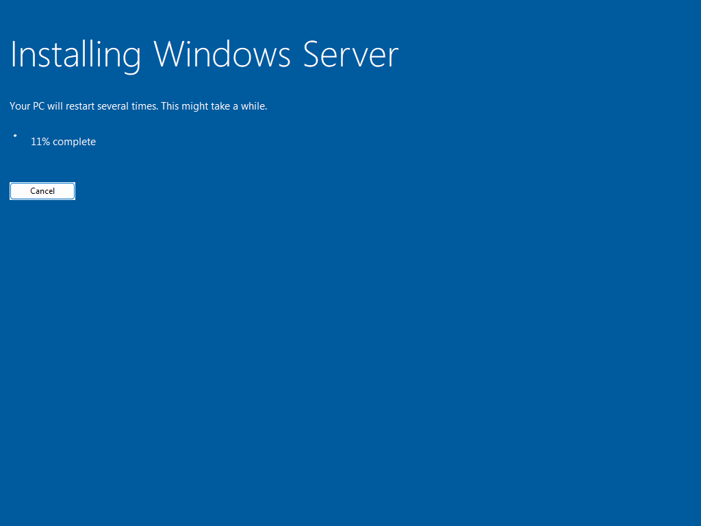
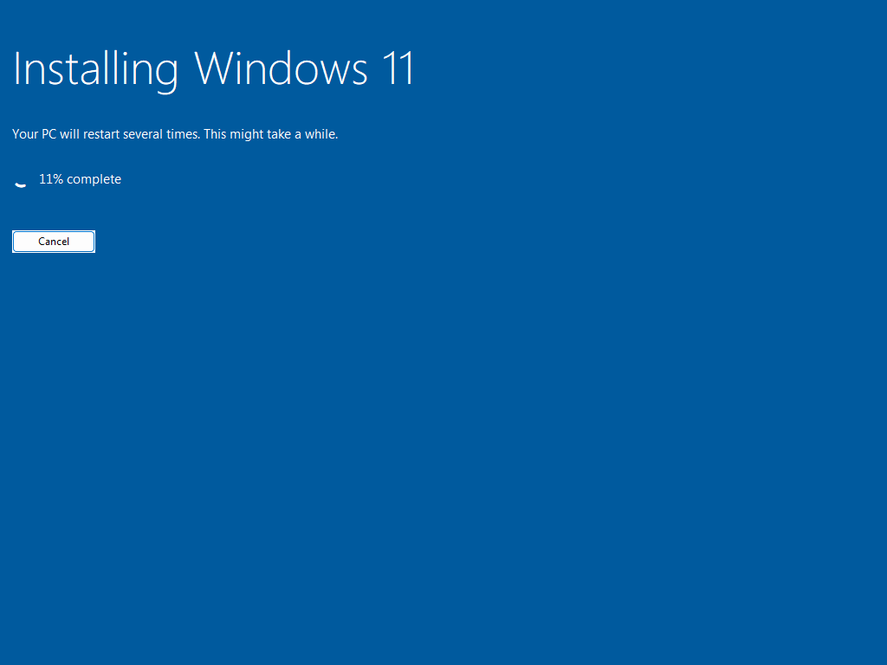

# 01 · Host and VirtualBox setup

> **Goal:** get the two Windows ISOs and build a private virtual network plus two virtual machines on my laptop.

## Why a company does this (the real-world version)

A company wouldn't use VirtualBox. It would run servers on VMware vSphere, Hyper-V or in Azure. The ideas carry straight over, though: servers are VMs, they sit on an isolated network segment, and they get a planned IP address. VirtualBox is free and runs on Windows 11 **Home** (Hyper-V needs Pro), so it's the right tool for a laptop lab.

## What I used

| Item | Value |
|---|---|
| Host | Windows 11 Home laptop, Ryzen 7 5800H (8 cores / 16 threads), 24 GB RAM, 150 GB free SSD |
| Hypervisor | Oracle VirtualBox 7.2 |
| Server ISO | Windows Server 2025 Evaluation (180-day trial), about 6 GB |
| Client ISO | Windows 11 Enterprise Evaluation (90-day trial), about 5.4 GB |

**Minimum to follow along:** 16 GB RAM (the VMs use 8 GB together), about 130 GB free disk, and virtualization (AMD-V / Intel VT-x) enabled in the BIOS.

## Step 1: Download the evaluation ISOs

Microsoft gives away time-limited evaluation copies for learning. Download them from the **Microsoft Evaluation Center** (search "Windows Server 2025 evaluation" and "Windows 11 Enterprise evaluation"). I picked **ISO download → 64-bit → English (United States)** for both.

I saved them to `C:\Users\<me>\LabISOs\` as `server2025.iso` and `win11ent.iso`.

> 💡 **Tip:** the direct links are Microsoft "fwlinks", so you can also use `curl -L -o server2025.iso "<link>"` in a terminal. It resumes if the download breaks (`-C -`).

## Step 2: Understand the network choice

VirtualBox offers several network types. This one decision keeps the lab from breaking your home Wi-Fi:

| Type | Can reach internet | Home network can see VMs | VMs see each other | Good for AD lab? |
|---|---|---|---|---|
| NAT (default) | ✅ | ❌ | ❌ | ❌ VMs are isolated from each other |
| **NAT Network** | ✅ | ❌ | ✅ | ✅ **what I used** |
| Bridged | ✅ | ✅ | ✅ | ⚠️ Dangerous: my DC's DHCP would hand out addresses to my family's phones |
| Internal | ❌ | ❌ | ✅ | ✅ but no Windows Update |

I created a NAT Network called **HarborNet** on `10.10.10.0/24` and turned **VirtualBox's built-in DHCP off**, because DC01 will be the DHCP server. Two DHCP servers on one network fight each other.

## Step 3: Create the network and VMs

### The GUI way (VirtualBox Manager)

1. **File → Tools → Network Manager → NAT Networks → Create.** Name it `HarborNet`, IPv4 prefix `10.10.10.0/24`, **untick "Enable DHCP"**.
2. **Machine → New**
   - Name `DC01`, ISO = `server2025.iso`, type Windows Server 2025 (64-bit).
   - Tick **Unattended Installation**. Username `Administrator`, a password, hostname `DC01`, domain `harborpoint.internal`, and tick **Install Guest Additions**.
   - Edition: **Windows Server 2025 Standard Evaluation (Desktop Experience)**. Without "Desktop Experience" you get Server Core: no GUI, command line only.
   - Hardware: 4096 MB RAM, 2 CPUs, **Enable EFI**. Disk: 60 GB.
3. VM **Settings → Network → Adapter 1 → Attached to: NAT Network → HarborNet**.
4. Repeat for `WS01`: ISO = `win11ent.iso`, type Windows 11 (64-bit), user `labadmin`, 4096 MB, 2 CPUs, 64 GB disk, same network. Windows 11 needs **TPM 2.0 and Secure Boot**. Check both are on under Settings → System → Motherboard (EFI, Secure Boot) and TPM version 2.0. My script sets them explicitly with `--tpm-type 2.0` and `modifynvram`.

### The PowerShell way (what I actually ran)

[`scripts/00-New-LabVMs.ps1`](../scripts/00-New-LabVMs.ps1) does all of the above with `VBoxManage.exe`, VirtualBox's command-line tool. The key lines:

```powershell
# private network, no VirtualBox DHCP
VBoxManage natnetwork add --netname HarborNet --network 10.10.10.0/24 --enable --dhcp off

# plug a VM's network card into it
VBoxManage modifyvm DC01 --nic1 natnetwork --nat-network1 HarborNet

# hands-free Windows install (image-index 2 = Standard with Desktop Experience)
VBoxManage unattended install DC01 --iso=server2025.iso --user=Administrator `
    --user-password=... --hostname=DC01.harborpoint.internal --image-index=2 `
    --install-additions --start-vm=headless
```

To find the right `--image-index`, ask the ISO what editions it contains:

```powershell
VBoxManage unattended detect --iso=server2025.iso
```

Real output from my Server ISO:

```
OS Flavor    = ServerStandardEval
Image #1     = Windows Server 2025 Standard Evaluation
Image #2     = Windows Server 2025 Standard Evaluation (Desktop Experience)   <-- this one
Image #3     = Windows Server 2025 Datacenter Evaluation
Image #4     = Windows Server 2025 Datacenter Evaluation (Desktop Experience)
Unattended installation supported = yes
```

The Windows 11 ISO only has one image: `#1 Windows 11 Enterprise Evaluation`.

> **Standard vs Datacenter?** They have the same features for a lab like this. Datacenter adds unlimited virtualization rights and some storage/network extras for big hosts. Most small companies buy Standard.

A few minutes after running the script, both VMs were installing on their own:

| DC01 (Server 2025) | WS01 (Windows 11) |
|---|---|
|  |  |

Windows installs itself in about 15–30 minutes per VM.

## Step 4: Verify

- VirtualBox Manager shows both VMs **Running**.
- `VBoxManage natnetwork list` shows HarborNet enabled with DHCP disabled.
- Each VM reaches the Windows desktop and is logged in automatically.

> ⚠️ **Evaluation gotcha:** my Windows 11 VM showed *"Windows License is expired"* and shut itself down every hour until it had internet access and could activate (`slmgr /ato`). See [doc 08](08-join-windows-11-client.md).

## Common mistakes

| Symptom | Cause | Fix |
|---|---|---|
| "VT-x/AMD-V is not available" | Virtualization is off in the BIOS, or Hyper-V/Memory Integrity is holding it | Enable SVM/VT-x in the BIOS |
| Windows 11 says "This PC can't run Windows 11" | No TPM 2.0 / Secure Boot / EFI | Settings → System: enable EFI, Secure Boot, TPM 2.0 |
| VMs can't ping each other | Adapter left on plain **NAT** instead of **NAT Network** | Change to NAT Network → HarborNet |
| Home devices get weird 10.10.10.x addresses | Used **Bridged** with a DHCP server in the lab | Switch to NAT Network immediately |

## Interview questions

- **"What's a hypervisor?"** Software that runs virtual machines by sharing one physical machine's CPU, RAM and disk. Type 1 runs on bare metal (ESXi, Hyper-V Server); Type 2 runs on top of an OS (VirtualBox, VMware Workstation).
- **"Why isolate a lab network?"** So lab services like DHCP and DNS can't interfere with the real network, and so experiments can't affect real devices.

⬅️ [00 · What is AD](00-what-is-active-directory.md) | ➡️ [02 · Install Windows Server](02-install-windows-server.md)
