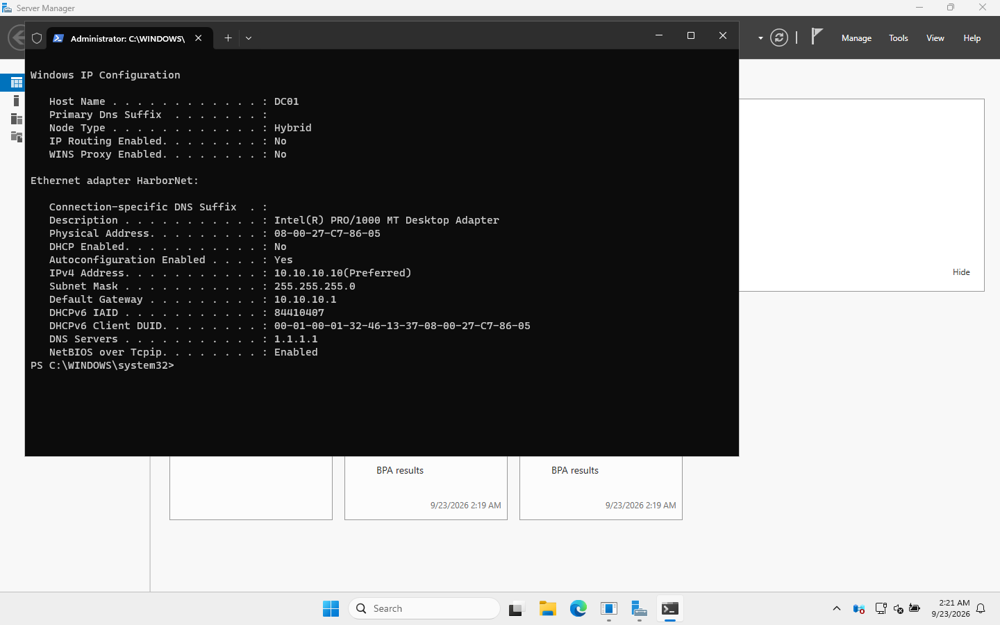

# 02 · Install Windows Server and give it a static IP

> **Goal:** a clean Windows Server 2025 install named `DC01`, with a fixed IP address of `10.10.10.10`.

## Why a company does this

Every server needs a **predictable name and address**. A domain controller is extra strict: every PC in the company uses it as its DNS server, so its IP must **never** change. If DHCP handed the DC a new address, nobody could log in the next morning.

| Device type | How it gets an IP | Why |
|---|---|---|
| Servers (DC, file, print) | **Static** (typed in by hand) | Others need to find them at a known address |
| Printers, network gear | Static, or a DHCP **reservation** | Same reason |
| Laptops/desktops | **DHCP** | Hundreds of devices, and nobody wants to type IPs |

## Step 1: The install

VirtualBox's unattended install did this for me (see [01](01-host-and-virtualbox-setup.md)). Doing it by hand, the choices that matter are:

1. Language/keyboard → **Next** → **Install now**.
2. Edition: **Windows Server 2025 Standard Evaluation (Desktop Experience)**.
   - *Without* "Desktop Experience" = **Server Core**: no Start menu, no File Explorer, managed remotely or from the command line. Companies like Core because it has fewer updates and a smaller attack surface. For learning, the GUI is easier.
3. **Custom: Install Windows only** → pick the empty 60 GB disk.
4. Set the built-in **Administrator** password when asked.
5. Log in with **Ctrl+Alt+Del**. In a VirtualBox window, use **Input → Keyboard → Insert Ctrl-Alt-Del**, or press **Right Ctrl + Del**.

Server Manager opens by itself at every logon. That's the server's main dashboard.

## Step 2: Check what address it got

With no DHCP server on HarborNet yet, the server gave *itself* an address:

```
InterfaceAlias IPAddress    PrefixLength PrefixOrigin
-------------- ---------    ------------ ------------
Ethernet       169.254.4.33           16    WellKnown
```

> 🎓 **169.254.x.x = APIPA** (Automatic Private IP Addressing). Windows uses it when it asked for DHCP and **nobody answered**. On a help desk, seeing `169.254` on a user's PC almost always means "can't reach the DHCP server": a cable, Wi-Fi, VLAN or DHCP problem. Remember this one; it comes up constantly.

## Step 3: Set the static IP

### GUI way

1. Server Manager → **Local Server** → click the blue link next to **Ethernet**. (Or press Win+R, type `ncpa.cpl`, and press Enter.)
2. Right-click the adapter → **Properties** → **Internet Protocol Version 4 (TCP/IPv4)** → **Properties**.
3. Select **Use the following IP address**:
   - IP address `10.10.10.10`
   - Subnet mask `255.255.255.0`
   - Default gateway `10.10.10.1`
4. **Use the following DNS server addresses:** preferred `1.1.1.1` for now. (After the DC is promoted, it points at itself.)
5. OK → OK. Optionally rename the adapter from "Ethernet" to `HarborNet` (right-click → Rename).

### PowerShell way

[`scripts/01-Set-StaticIP.ps1`](../scripts/01-Set-StaticIP.ps1):

```powershell
$nic = Get-NetAdapter | Where-Object Status -eq 'Up' | Select-Object -First 1
New-NetIPAddress -InterfaceIndex $nic.ifIndex -IPAddress 10.10.10.10 -PrefixLength 24 -DefaultGateway 10.10.10.1
Set-DnsClientServerAddress -InterfaceIndex $nic.ifIndex -ServerAddresses 1.1.1.1
Rename-NetAdapter -Name $nic.Name -NewName 'HarborNet'
```

> 🎓 **What is `/24` / `-PrefixLength 24`?** The same thing as subnet mask `255.255.255.0`: the first 24 bits (three numbers) are the network (`10.10.10`), and the last number is the device. So this network holds `10.10.10.1`–`10.10.10.254`.

The computer name: the unattended install already named it `DC01`. By hand: Server Manager → Local Server → click the computer name → **Change** → `DC01` → restart. **Rename before promoting to a DC.** Renaming a DC afterwards is a much bigger job.

## Step 4: Verify

`ipconfig /all` on DC01:



Check:
- `IPv4 Address: 10.10.10.10(Preferred)` ✅
- `DHCP Enabled: No` ✅ (static)
- `Default Gateway: 10.10.10.1` ✅
- Internet works: `Test-NetConnection 1.1.1.1 -Port 443` → `TcpTestSucceeded : True` ✅

## Common mistakes

| Mistake | What happens |
|---|---|
| Promoting to DC while still on a DHCP address | DNS records point to an address that later changes, and logins break |
| Wrong subnet mask (e.g. 255.255.0.0) | Works "sometimes"; routing gets weird |
| DC's DNS pointing at the router or 8.8.8.8 *after* promotion | The DC can't find itself; replication/GPO/logon errors |
| Renaming the server after promotion | Possible, but painful. Rename first. |

## Interview questions

- **"A user's IP is 169.254.x.x. What does that tell you?"** Their PC asked for a DHCP address and got no answer. I'd check the physical/Wi-Fi connection first, then whether the DHCP server and scope are up and the scope isn't full, then run `ipconfig /release` and `ipconfig /renew`.
- **"Why do servers use static IPs?"** Other devices and DNS records depend on the address. A DC especially, because clients use it for DNS.
- **"What's the difference between Server Core and Desktop Experience?"** Core has no GUI and is managed remotely or via PowerShell. It's smaller and more secure, with fewer patches. Desktop Experience has the full GUI.

⬅️ [01 · Host setup](01-host-and-virtualbox-setup.md) | ➡️ [03 · Promote the domain controller](03-promote-domain-controller.md)
