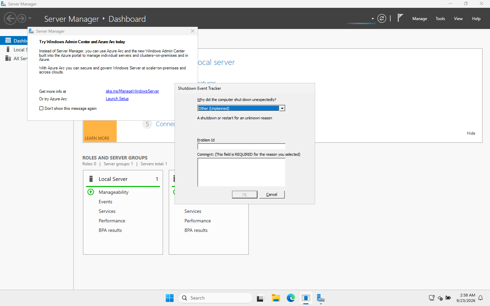

# 03 · Promote DC01 to a domain controller

> **Goal:** install Active Directory Domain Services (AD DS) and create a brand-new forest and domain, `harborpoint.internal`, with DC01 as its first domain controller.

## Why a company does this

This is the moment "a Windows server" becomes "the company's identity system". After this step:
- There's one central list of users, groups and computers.
- DC01 checks every login (Kerberos) and runs DNS for the domain.
- Group Policy becomes possible.

A real company would build **at least two** DCs so logins keep working if one fails. With one laptop, I built one, and I note that in the lessons page.

## Key decisions before clicking anything

| Decision | My choice | Why |
|---|---|---|
| Domain name | `harborpoint.internal` | `.internal` is reserved by ICANN for private networks (2024), so it can never clash with a real internet domain. **Avoid `.local`**: it conflicts with Apple Bonjour/mDNS. Many companies use a subdomain they own, like `ad.harborpoint.com`. |
| NetBIOS name | `HARBORPOINT` | The short, old-style name users see as `HARBORPOINT\priya.patel`. Max 15 characters. |
| Install DNS | Yes | AD depends on DNS, and the first DC almost always hosts it. |
| Functional level | Default (Windows Server 2025) | Only matters when older DCs must join. |
| DSRM password | a separate strong password | "Directory Services Restore Mode" is a safe-mode login for repairing AD. Store it in the password manager, because you'll need it on your worst day. |

## GUI steps

1. **Server Manager → Manage → Add Roles and Features.**
2. Role-based installation → select DC01 → tick **Active Directory Domain Services** → **Add Features** (the management tools) → Next through to **Install**.
3. When it finishes, a **yellow flag** ⚠️ appears in Server Manager. Click it → **Promote this server to a domain controller**.
4. **Deployment Configuration:** *Add a new forest* → Root domain name `harborpoint.internal`.
5. **Domain Controller Options:** leave DNS server and Global Catalog ticked. Type the **DSRM password** twice.
6. **DNS Options:** you'll see a warning about a DNS delegation. That's normal here (explained below). Next.
7. **Additional Options:** NetBIOS name `HARBORPOINT`.
8. **Paths:** keep the defaults (`C:\Windows\NTDS`, `C:\Windows\SYSVOL`).
9. **Prerequisites Check** → **Install**. The server reboots by itself.
10. Log in again as **HARBORPOINT\Administrator**. The login screen now says "Sign in to: HARBORPOINT".

## PowerShell way

[`scripts/02-Install-ADDS.ps1`](../scripts/02-Install-ADDS.ps1):

```powershell
Install-WindowsFeature AD-Domain-Services -IncludeManagementTools

Install-ADDSForest `
    -DomainName 'harborpoint.internal' `
    -DomainNetbiosName 'HARBORPOINT' `
    -InstallDns `
    -SafeModeAdministratorPassword $dsrm `
    -Force
```

Real output from my lab:

```
Success Restart Needed Exit Code      Feature Result
------- -------------- ---------      --------------
True    No             Success        {Active Directory Domain Services, Group P...

A delegation for this DNS server cannot be created because the authoritative parent zone
cannot be found or it does not run Windows DNS server. ...Otherwise, no action is required.

Message        : Operation completed successfully
Status         : Success
```

> 🎓 **That DNS delegation warning is expected.** The wizard tries to tell the *parent* zone (`.internal`) that DC01 is in charge of `harborpoint.internal`. There is no parent server for `.internal` on the internet, so there's nothing to update. You only act on this when joining an existing DNS setup.

## Verify it worked

```powershell
Get-ADDomain | Select DNSRoot, NetBIOSName, DomainMode
nltest /dsgetdc:harborpoint.internal
Get-SmbShare SYSVOL, NETLOGON
dcdiag /q          # prints nothing if every test passes
```

`nltest` from my lab, once everything was healthy:

```
           DC: \\DC01.harborpoint.internal
      Address: \\10.10.10.10
     Dom Name: harborpoint.internal
        Flags: PDC GC DS LDAP KDC TIMESERV GTIMESERV WRITABLE DNS_DC DNS_DOMAIN DNS_FOREST ...
```

What those flags mean: **PDC** = holds the PDC Emulator role (time source, password changes). **GC** = Global Catalog. **KDC** = hands out Kerberos tickets. **WRITABLE** = not a read-only DC.

## 🔥 What actually went wrong for me (and how I fixed it)

After the reboot, DC01 sat on **"Applying computer settings"** for more than 15 minutes.

**Diagnosis**, done remotely from the other VM, since the DC's own screen was stuck:

| Check | Result | Meaning |
|---|---|---|
| Ping / ports 53, 88, 389 | ✅ all open | AD services were running |
| `Get-Service NTDS,DNS,KDC,Netlogon` | ✅ Running | Same |
| `nltest /dsgetdc:harborpoint.internal` | ❌ `ERROR_NO_SUCH_DOMAIN` | The DC wasn't **advertising** itself |
| `SysvolReady` registry value | ❌ `0` | **SYSVOL never finished setting up** |
| `Get-SmbShare` | ❌ no SYSVOL / NETLOGON shares | Same |
| DFS Replication event log | ❌ Event **1202**: "failed to contact domain controller" | The service that builds SYSVOL gave up at boot |

A DC won't announce itself until SYSVOL is ready, and the DFS Replication service (DFSR) builds SYSVOL. At boot, DFSR tried to contact a DC before AD had finished starting, failed, and waited.

**Fix:**

```powershell
Restart-Service DFSR
```

Within a minute, event **4602** appeared ("successfully initialized the SYSVOL replicated folder"), `SysvolReady` became `1`, the SYSVOL and NETLOGON shares appeared, and the server finished logging in.

> 🎓 **Lesson:** "Applying computer settings" forever on a DC is usually **DNS or SYSVOL**. Check `SysvolReady`, the DFS Replication log, and `nltest /dsgetdc` before rebooting again.

Because I had to hard-reset the VM, Windows Server asked why on the next login. This **Shutdown Event Tracker** is a server feature that makes admins record the reason for unexpected restarts:



## Common mistakes

| Mistake | Result |
|---|---|
| Promoting before setting a static IP | DNS records point at an address that later changes |
| Using `.local` | mDNS conflicts, especially with Macs and phones |
| Losing the DSRM password | No way into Directory Services Restore Mode when AD needs repair |
| Only one DC in production | If it dies, nobody can log in and there's no copy of AD |

## Interview questions

- **"What happens when you promote a server?"** It installs the AD database (`NTDS.dit`), creates SYSVOL for Group Policy, registers its DNS SRV records so clients can find it, and starts the KDC for Kerberos.
- **"What's a forest vs a domain?"** A forest is the top-level security boundary containing one or more domains that trust each other. My lab has one forest with one domain.
- **"What are FSMO roles?"** Five special jobs only one DC does at a time: Schema Master, Domain Naming Master (forest-wide), RID Master, PDC Emulator and Infrastructure Master (per domain). With one DC, DC01 holds all five. Check with `netdom query fsmo`.
- **"What's SYSVOL?"** A folder shared by every DC, replicated by DFSR, holding Group Policy files and logon scripts. If it's missing, Group Policy breaks.

⬅️ [02 · Install Windows Server](02-install-windows-server.md) | ➡️ [04 · DNS and DHCP](04-dns-and-dhcp.md)
