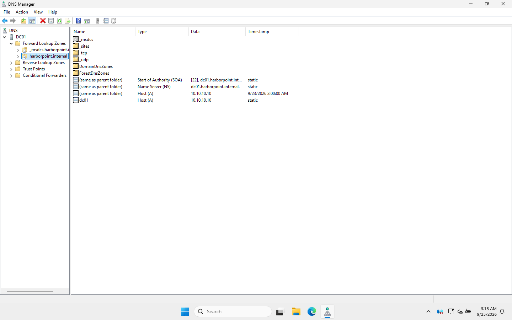
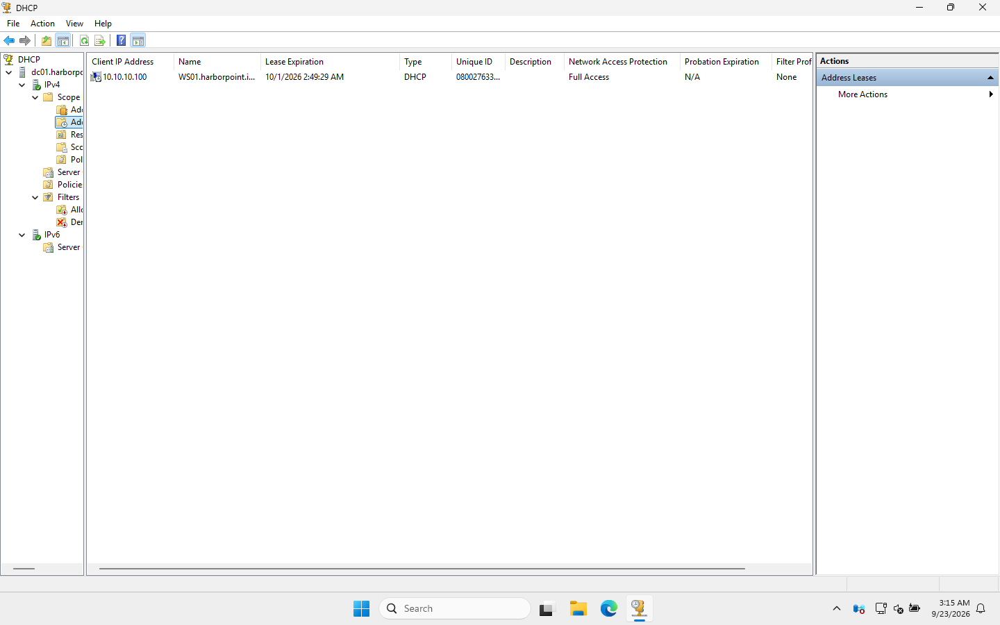

# 04 · DNS and DHCP

> **Goal:** DC01 answers every name lookup for the office (DNS) and hands out IP addresses to PCs automatically (DHCP). I also make sure the domain has a reliable clock.

## Why a company does this

- **DNS**: PCs find the domain controller *by name*, using DNS SRV records. Every PC must use the DC as its DNS server. If it doesn't, logins, Group Policy and file shares all fail in confusing ways.
- **DHCP**: nobody wants to type IP settings into 20 PCs by hand. DHCP gives each PC an IP, the gateway (the way to the internet) and the DNS server, all automatically.
- **Time**: Kerberos logins **fail if a PC's clock is more than 5 minutes off the DC's clock**. The first DC is the time source for the whole domain, so it needs a good clock itself.

## Part 1: DNS

Promoting DC01 already created the main zone (`harborpoint.internal`). I added three things:

| Setting | Value | Why |
|---|---|---|
| **Forwarders** | `1.1.1.1`, `8.8.8.8` | DC01 doesn't know `google.com`. Instead of working it out from the root servers, it asks these public resolvers |
| **Reverse lookup zone** | `10.10.10.in-addr.arpa` | Lets tools turn an IP back into a name (`nslookup 10.10.10.10` → `dc01`) |
| **DC's own DNS client** | `127.0.0.1` | The DC uses itself for DNS |

### GUI steps
1. Server Manager → **Tools → DNS**.
2. **Forwarders:** right-click **DC01 → Properties → Forwarders** tab → **Edit** → add `1.1.1.1` and `8.8.8.8`.
3. **Reverse zone:** right-click **Reverse Lookup Zones → New Zone** → Primary zone, *store in AD* → "To all DNS servers in this domain" → IPv4 → Network ID `10.10.10` → allow only secure dynamic updates.

### What the zone looks like



- **SOA** (Start of Authority) and **NS** (Name Server): "DC01 is in charge of this zone."
- **A records**: name → IP (`dc01` → `10.10.10.10`).
- The folders **`_msdcs`, `_sites`, `_tcp`, `_udp`** hold the **SRV records** that tell PCs where the domain controllers, Kerberos and LDAP services are. **Never delete these.**

Proving the SRV record works, from the Windows 11 PC:

```
PS> Resolve-DnsName _ldap._tcp.dc._msdcs.harborpoint.internal -Type SRV -Server 10.10.10.10

Name                                      Type NameTarget                Port
----                                      ---- ----------                ----
_ldap._tcp.dc._msdcs.harborpoint.internal  SRV dc01.harborpoint.internal  389
```

## Part 2: DHCP

| Setting | Value |
|---|---|
| Scope name | HarborPoint Workstations |
| Range | `10.10.10.100` – `10.10.10.200` (101 addresses for 20 staff, room to grow) |
| Lease | 8 days (the Windows default) |
| Option 003 Router | `10.10.10.1` |
| Option 006 DNS Servers | `10.10.10.10` ← **the DC, never the router** |
| Option 015 DNS Domain | `harborpoint.internal` |

Addresses below `.100` are kept free for things with static IPs: servers, printers, network gear.

### GUI steps
1. **Manage → Add Roles and Features →** tick **DHCP Server** → Install.
2. Click the yellow flag → **Complete DHCP configuration** → Commit. This **authorizes** the server in AD and creates the DHCP security groups.
3. **Tools → DHCP** → expand `dc01` → right-click **IPv4 → New Scope** and enter the values above. Add the router, DNS server and domain name on the "Configure DHCP Options" pages, then activate the scope.

> 🎓 **Why "authorize"?** A DHCP server that isn't authorized in AD refuses to hand out addresses. It stops someone plugging in a rogue DHCP server (like a home router) and taking over the network.

### Proof it works

WS01 had a `169.254.x.x` address before this step. After `ipconfig /renew`:

```
   DHCP Enabled. . . . . . . . . . . : Yes
   IPv4 Address. . . . . . . . . . . : 10.10.10.100(Preferred)
   Lease Obtained. . . . . . . . . . : Wednesday, September 23, 2026 2:59:09 AM
   Lease Expires . . . . . . . . . . : Thursday, October 1, 2026 2:59:11 AM
   Default Gateway . . . . . . . . . : 10.10.10.1
   DHCP Server . . . . . . . . . . . : 10.10.10.10
   DNS Servers . . . . . . . . . . . : 10.10.10.10
```

And on the server, **DHCP → IPv4 → Scope → Address Leases**:



## Part 3: Time (a problem I actually hit)

When I checked, DC01's clock was **9 minutes behind** real time. That's enough to break Kerberos: domain joins and logins would fail with vague errors.

```powershell
w32tm /config /manualpeerlist:"time.windows.com,0x8 pool.ntp.org,0x8" /syncfromflags:manual /reliable:yes /update
Restart-Service W32Time
w32tm /resync /force
w32tm /query /status
```

```
Stratum: 4 (secondary reference - syncd by (S)NTP)
Source: pool.ntp.org,0x8
Last Successful Sync Time: 9/23/2026 3:01:34 AM
```

> 🎓 **The time chain in a domain:** PCs → sync from a DC → the DC with the **PDC Emulator** role → an external NTP source. Only the PDC Emulator should point at the internet.

## PowerShell

All of the above is in [`scripts/03-Configure-DNS-DHCP.ps1`](../scripts/03-Configure-DNS-DHCP.ps1). The key lines:

```powershell
Set-DnsServerForwarder -IPAddress 1.1.1.1, 8.8.8.8
Add-DnsServerPrimaryZone -NetworkId '10.10.10.0/24' -ReplicationScope Domain
Install-WindowsFeature DHCP -IncludeManagementTools
Add-DhcpServerInDC -DnsName 'dc01.harborpoint.internal' -IPAddress 10.10.10.10
Add-DhcpServerv4Scope -Name 'HarborPoint Workstations' -StartRange 10.10.10.100 -EndRange 10.10.10.200 -SubnetMask 255.255.255.0
Set-DhcpServerv4OptionValue -ScopeId 10.10.10.0 -Router 10.10.10.1 -DnsServer 10.10.10.10 -DnsDomain harborpoint.internal
```

## Common mistakes

| Mistake | Symptom |
|---|---|
| DHCP hands out the **router** (or 8.8.8.8) as DNS | "The domain could not be contacted" on join. Logins are slow and GPOs don't apply |
| Forgetting to authorize DHCP | Clients keep getting `169.254.x.x` |
| Two DHCP servers on one network | Random wrong IPs/gateways (why I turned VirtualBox's DHCP off) |
| Scope too small | New devices get `169.254.x.x` once it's full |
| DC clock drift | Kerberos errors, "The trust relationship... failed", time-skew errors |

## Interview questions

- **"A user can browse the internet but can't reach any company resources. What do you check?"** Their DNS server. If it's the router or a public DNS, internet names resolve but `harborpoint.internal` doesn't. Run `ipconfig /all`, then `nslookup dc01`.
- **"What does DORA stand for?"** The DHCP handshake: **D**iscover → **O**ffer → **R**equest → **A**cknowledge.
- **"What's an SRV record?"** A DNS record that says which server offers a service on which port. AD clients look up `_ldap._tcp.dc._msdcs.<domain>` to find DCs.
- **"What's a DHCP reservation?"** A fixed IP that DHCP always gives to one device, matched by MAC address. Good for printers.
- **"Why does time matter in AD?"** Kerberos tickets carry timestamps. More than 5 minutes of difference and authentication fails.

⬅️ [03 · Promote DC](03-promote-domain-controller.md) | ➡️ [05 · OUs, users and groups](05-ous-users-groups.md)
