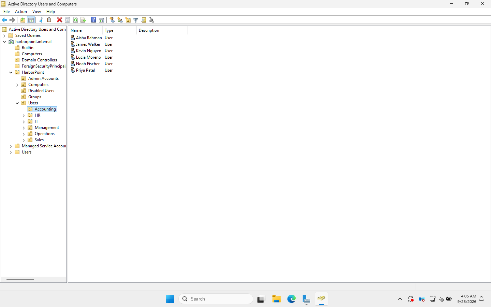
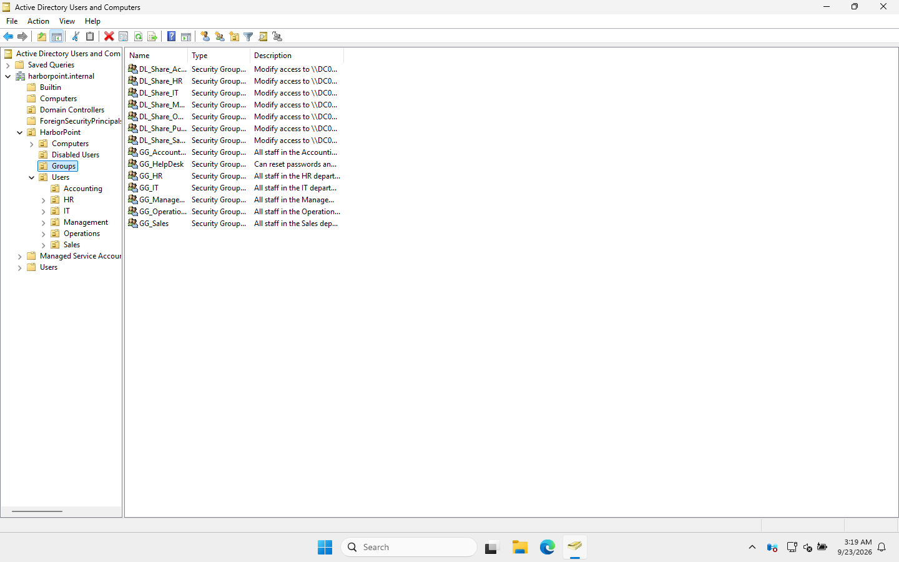

# 05 · OUs, users and groups

> **Goal:** give Harbor Point a tidy AD structure: department OUs, 20 user accounts, security groups built the AGDLP way, separate admin accounts, and a help desk group that can reset passwords and nothing more.

## Why a company does this

- **OUs** decide *where Group Policy lands* and *who can manage what*. A good OU design makes both easy.
- **Groups** decide *who can access what*. Grant access to groups, never to individual users. When someone joins or leaves, you change one group membership instead of 15 folder permissions.
- **Separate admin accounts** mean that if an everyday account is phished, the attacker doesn't get Domain Admin.
- **Delegation** lets the help desk fix everyday problems without being Domain Admins.

## The OU design

```
harborpoint.internal
└── HarborPoint                  ← everything we create lives under one top OU
    ├── Admin Accounts           ← adm.* accounts (kept OUT of Users, see HD-1002 in doc 09)
    ├── Computers
    │   └── Workstations         ← new PCs land here automatically (redircmp)
    ├── Disabled Users           ← leavers wait here before deletion
    ├── Groups                   ← all security groups
    └── Users
        ├── Accounting  (6)
        ├── HR          (1)
        ├── IT          (2)
        ├── Management  (2)
        ├── Operations  (4)
        └── Sales       (5)
```



> 🎓 **Why not use the built-in "Users" and "Computers" folders?** They're *containers*, not OUs, so **you can't link a GPO to them**. A PC that joins the domain lands in `Computers` by default and gets no OU policies (I reproduce that exact problem in ticket HD-1006). `redircmp` changes the default to our Workstations OU.

## The users

The 20 staff come from [`scripts/users.csv`](../scripts/users.csv):

```csv
FirstName,LastName,Department,Title
Margaret,Holloway,Management,Managing Partner
Priya,Patel,Accounting,Senior Accountant
Rachel,Kim,Sales,Sales Manager
...
```

Naming standard:
- **Logon name (sAMAccountName):** `first.last` → `priya.patel`
- **UPN (email-style logon):** `priya.patel@harborpoint.internal`
- **Temporary password** + **"User must change password at next logon"** ✅

### GUI: create one user
1. **Tools → Active Directory Users and Computers** (ADUC).
2. Right-click **HarborPoint → Users → Accounting → New → User**.
3. First name `Priya`, Last name `Patel`, User logon name `priya.patel` → Next.
4. Temporary password twice, tick **User must change password at next logon** → Next → Finish.
5. Right-click the user → **Properties**: fill **Job Title** and **Department** (Organization tab), then add the group (Member Of tab → Add → `GG_Accounting`).

### PowerShell: all 20 at once
```powershell
.\automation\New-BulkUsers.ps1 -CsvPath .\users.csv
```
```
Created margaret.holloway (Management)
Created david.chen (Management)
Created priya.patel (Accounting)
...
Created maya.singh (IT)
```

## Groups: the AGDLP model

**A**ccounts → **G**lobal groups → **D**omain **L**ocal groups → **P**ermissions

```
priya.patel ─┐
james.walker ├─► GG_Accounting ──► DL_Share_Accounting ──► Modify on C:\Shares\Accounting
 ...         ┘   (who they are)      (what they can do)
```

| Group | Scope | Members | Used for |
|---|---|---|---|
| `GG_Accounting` … `GG_IT` | Global | the staff in that department | "who is in Accounting" |
| `DL_Share_Accounting` … | Domain Local | the matching `GG_` group | the folder's permissions |
| `DL_Share_Public` | Domain Local | Domain Users | everyone's Public share |
| `GG_HelpDesk` | Global | `adm.maya.singh` | delegated password resets |



> 🎓 **Why two layers?** In a one-domain company it can look like overkill, but it scales. If Harbor Point bought another company with its own domain, *their* `GG_` groups could be added to *our* `DL_` groups without touching a single folder permission. It's also what interviewers expect you to know.

## Admin accounts

| Person | Everyday account | Admin account | Rights |
|---|---|---|---|
| Ethan Brooks | `ethan.brooks` | `adm.ethan.brooks` | Domain Admins |
| Maya Singh | `maya.singh` | `adm.maya.singh` | GG_HelpDesk only |

They read email and browse the web as `ethan.brooks`. They sign in as `adm.ethan.brooks` only for admin work.

## Delegation: the help desk can reset passwords, nothing else

GUI: right-click the **Users** OU → **Delegate Control…** → add `GG_HelpDesk` → tick **"Reset user passwords and force password change at next logon"** → Finish. I also let them unlock accounts (write `lockoutTime`).

PowerShell (what the wizard does behind the scenes):
```powershell
dsacls "OU=Users,OU=HarborPoint,DC=harborpoint,DC=internal" /I:S /G "HARBORPOINT\GG_HelpDesk:CA;Reset Password;user"
dsacls "OU=Users,OU=HarborPoint,DC=harborpoint,DC=internal" /I:S /G "HARBORPOINT\GG_HelpDesk:RPWP;lockoutTime;user"
dsacls "OU=Users,OU=HarborPoint,DC=harborpoint,DC=internal" /I:S /G "HARBORPOINT\GG_HelpDesk:RPWP;pwdLastSet;user"
```

Verified:
```
Allow HARBORPOINT\GG_HelpDesk         Reset Password
Allow HARBORPOINT\GG_HelpDesk         SPECIAL ACCESS for pwdLastSet
Allow HARBORPOINT\GG_HelpDesk         SPECIAL ACCESS for lockoutTime
```

And tested in [doc 09](09-helpdesk-tickets.md): Maya **can** unlock and reset Priya, but gets **"Insufficient access rights"** when she tries to *disable* an account.

## Common mistakes

| Mistake | Why it hurts |
|---|---|
| Granting folder access to individual users | 20 users × 7 folders = a permissions mess nobody can audit |
| Leaving new PCs in the `Computers` container | OU-linked GPOs never reach them |
| Admin accounts inside an OU the help desk can manage | The help desk can reset a Domain Admin's password and become one (**I did this, see HD-1002**) |
| Everyone is a Domain Admin "to make things work" | One phished account = whole company compromised |
| Deleting OUs by accident | Prevented by "Protect object from accidental deletion" (on by default) |

## Interview questions

- **"What's the difference between Global, Domain Local and Universal groups?"** Global = members from its own domain, usable anywhere in the forest (use for *people*). Domain Local = members from anywhere, usable only in its own domain (use for *permissions*). Universal = forest-wide, stored in the Global Catalog.
- **"Security group vs distribution group?"** Security groups can be given permissions. Distribution groups are only email lists.
- **"How would you give the help desk rights to reset passwords without making them admins?"** Delegation of Control on the users' OU, granted to a help desk group.
- **"Why do admins have two accounts?"** Least privilege. The powerful account is used rarely and never for email or web, so it's much harder to phish.

⬅️ [04 · DNS and DHCP](04-dns-and-dhcp.md) | ➡️ [06 · File shares](06-file-shares-permissions.md)
