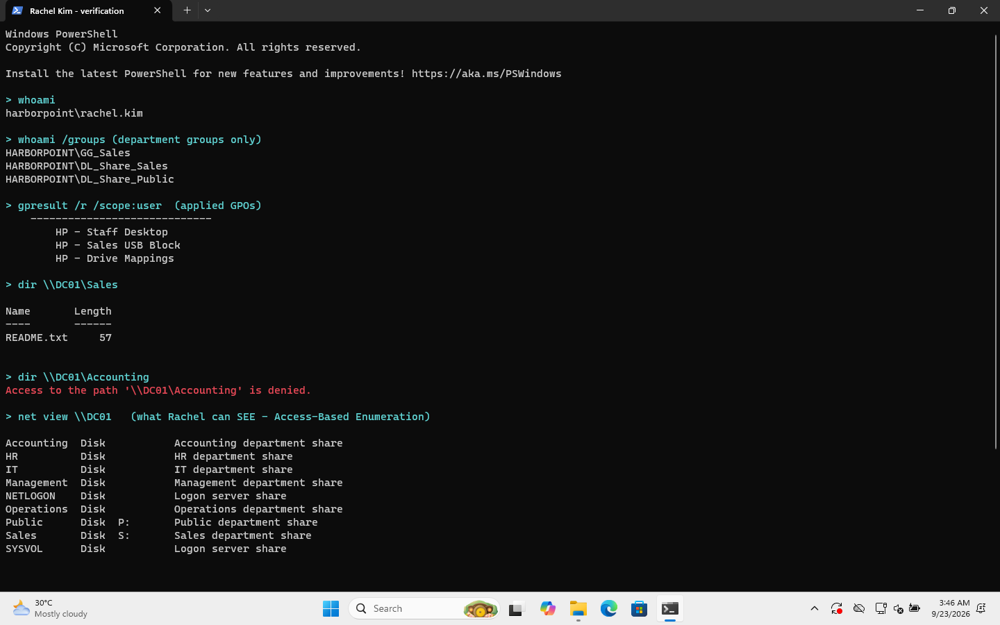

# 06 · File shares and permissions

> **Goal:** each department gets its own shared folder that only it can open, and the whole company gets a Public folder.

## Why a company does this

Accounting holds payroll and client tax files. Sales shouldn't be able to open them, even by accident. Shared folders with the right permissions are the most common thing a help desk gets tickets about ("I can't open the S: drive!"), so understanding them properly is valuable.

## The two permission layers

Every network share has **two** sets of permissions, and **the most restrictive one wins**:

| Layer | Where you set it | Applies when |
|---|---|---|
| **Share permissions** | Folder → Properties → **Sharing** → Advanced Sharing → Permissions | Only when connecting **over the network** (`\\DC01\Sales`) |
| **NTFS permissions** | Folder → Properties → **Security** | **Always**: over the network *and* when logged on locally |

Common practice, and what I did: set the share layer **wide open** (Authenticated Users = Full Control) and do all the real control in **NTFS**. Then there's only one place to look when access is wrong.

| Folder | NTFS permissions |
|---|---|
| `C:\Shares\Accounting` | Administrators: Full · SYSTEM: Full · **DL_Share_Accounting: Modify** |
| `C:\Shares\Sales` | Administrators: Full · SYSTEM: Full · **DL_Share_Sales: Modify** |
| … one per department … | |
| `C:\Shares\Public` | Administrators: Full · SYSTEM: Full · **DL_Share_Public (all staff): Modify** |

> 🎓 **Modify vs Full Control:** Modify = read, write, delete. Full Control adds **change permissions** and **take ownership**. Regular staff should never have Full Control, or they can lock IT out of their own folder.

> 🎓 **Inheritance:** by default a folder copies ("inherits") permissions from its parent. I turned inheritance **off** on each department folder so that nothing from `C:\` (like "Users: Read") leaks in.

## GUI steps (for one folder)

1. On DC01, create `C:\Shares\Sales`.
2. Right-click → **Properties → Security → Advanced → Disable inheritance** → *Remove all inherited permissions*.
3. **Add**: `Administrators` Full control, `SYSTEM` Full control, `DL_Share_Sales` **Modify** (applies to "This folder, subfolders and files").
4. **Sharing tab → Advanced Sharing** → tick **Share this folder** → Permissions → remove *Everyone* → add **Authenticated Users: Full Control**.
5. Server Manager → **File and Storage Services → Shares** → right-click the share → Properties → Settings → tick **Enable access-based enumeration**.

> In a real company the shares would be on a separate **file server**, not the domain controller. With only two VMs, DC01 does both jobs.

## PowerShell

[`scripts/05-New-FileShares.ps1`](../scripts/05-New-FileShares.ps1):

```powershell
icacls C:\Shares\Sales /inheritance:r `
    /grant:r 'BUILTIN\Administrators:(OI)(CI)F' `
    /grant:r 'NT AUTHORITY\SYSTEM:(OI)(CI)F' `
    /grant:r 'HARBORPOINT\DL_Share_Sales:(OI)(CI)M'

New-SmbShare -Name Sales -Path C:\Shares\Sales `
    -FullAccess 'NT AUTHORITY\Authenticated Users' -FolderEnumerationMode AccessBased
```

`(OI)(CI)` means **O**bject **I**nherit + **C**ontainer **I**nherit: the permission flows down to all files and subfolders. `F` = Full, `M` = Modify.

Result, exactly as it printed:
```
C:\Shares\Sales BUILTIN\Administrators:(F)
                HARBORPOINT\DL_Share_Sales:(OI)(CI)(M)
                NT AUTHORITY\SYSTEM:(OI)(CI)(F)
                BUILTIN\Administrators:(OI)(CI)(F)
```
The first line (no `(OI)(CI)`) is an extra Administrators entry on the folder itself only. It's harmless, because the last line already gives Administrators Full Control everywhere.

## Verify it: logged on as Rachel Kim (Sales)



- `dir \\DC01\Sales` → works ✅
- `dir \\DC01\Accounting` → **Access to the path is denied** ✅

## ❗ Something I got wrong at first: Access-Based Enumeration

I expected ABE to **hide** the Accounting share from Rachel completely. It doesn't. `net view \\DC01` still lists every share (see the bottom of the screenshot above).

What ABE *actually* does: **inside** a share, it hides the files and subfolders you have no permission to open. So in a shared "Clients" folder with one subfolder per client, each salesperson would only see their own clients' folders.

To hide a share *name* from casual browsing, you add `$` to the end of the name (`Payroll$`). That's hiding, **not security**: the NTFS permissions are what actually protect the data.

## Common mistakes

| Mistake | Result |
|---|---|
| Giving `Everyone` Full Control on NTFS | Anyone can delete everything, or change the permissions |
| Forgetting that the *stricter* layer wins | "I gave them Modify but they can only read!" (the share permission was Read) |
| Granting to users instead of groups | Unmanageable after a few staff changes |
| User added to the group but still denied | Group memberships are only read **at logon**, so they need to **sign out and back in** (ticket HD-1005) |

## Interview questions

- **"A user can't open a shared folder. How do you troubleshoot?"** Can they reach the server (ping or the UNC path)? What's the exact error? Are they in the right group (`whoami /groups`)? Did they sign out and in after being added? Then check the share permissions *and* NTFS permissions. **Effective Access** (Security → Advanced → Effective Access) shows the combined result for one user.
- **"Share vs NTFS permissions?"** Share applies only over the network; NTFS applies always; the most restrictive wins.
- **"What does Modify allow that Read & Execute doesn't?"** Creating, changing and deleting files.

⬅️ [05 · OUs, users and groups](05-ous-users-groups.md) | ➡️ [07 · Group Policy](07-group-policy.md)
