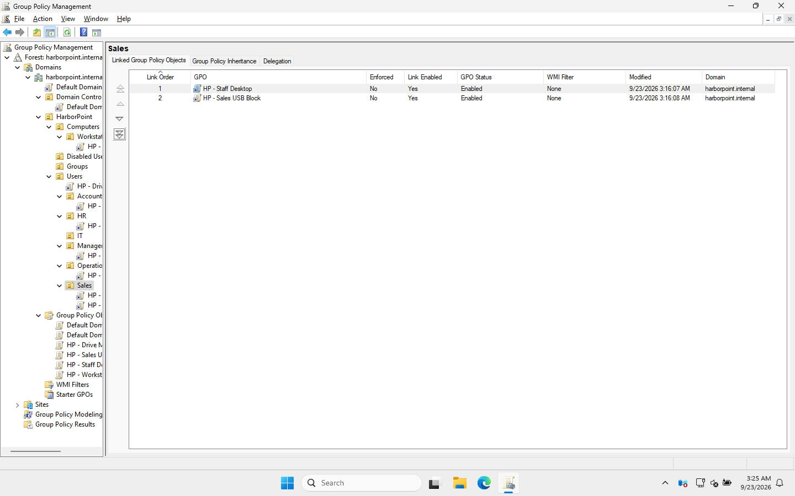
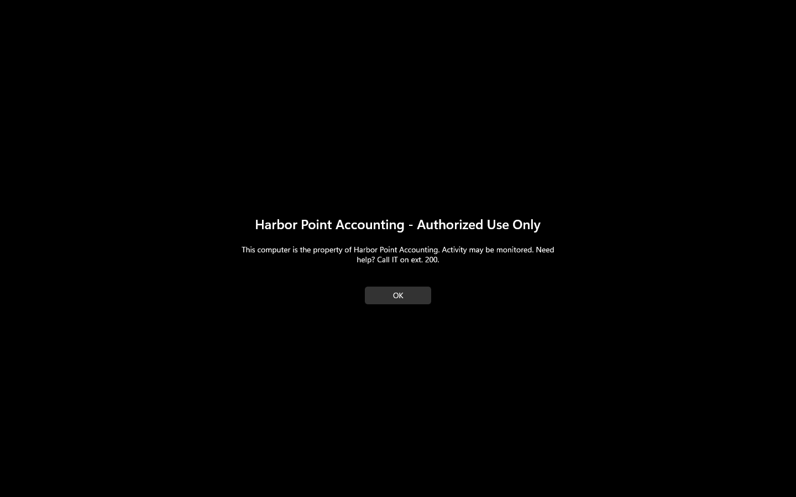
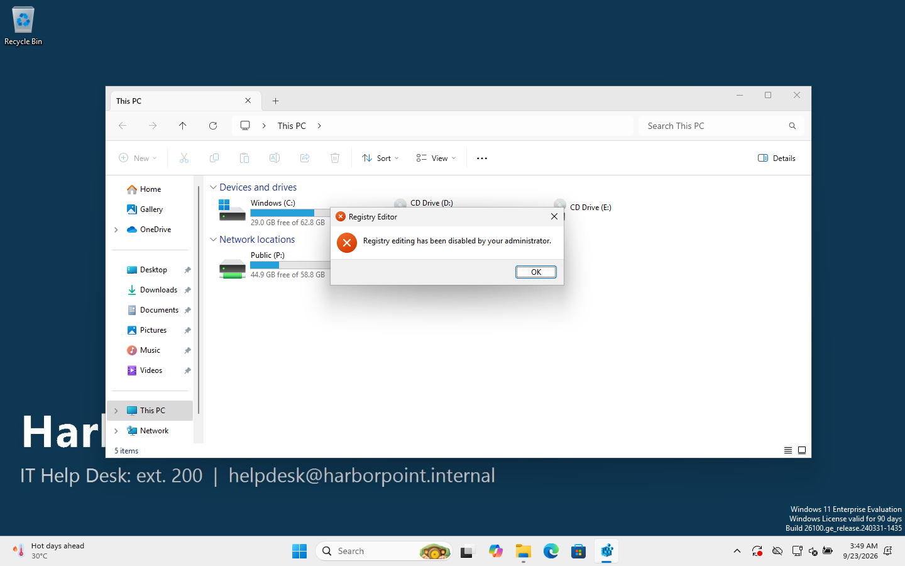

# 07 · Group Policy

> **Goal:** push Harbor Point's rules to every PC and user automatically: password rules, screen lock, a login banner, the company wallpaper, drive mappings and a USB block for Sales.

## Why a company does this

Without Group Policy, IT would configure each PC by hand, and users could undo it. With it, you set a rule **once** and every matching computer or user applies it at startup, at logon, and again about every 90 minutes.

## How a GPO reaches a PC

```
 GPO  ──(linked to)──►  OU  ──(contains)──►  users / computers
```

- A **GPO** is a bundle of settings, stored in AD and in the SYSVOL share.
- It does nothing until it's **linked** to a site, the domain, or an OU.
- **Computer settings** apply to computers in the OU. **User settings** apply to users in the OU.
- Processing order is **L-S-D-OU**: Local → Site → Domain → OU (parent then child). **Last applied wins** if two GPOs conflict.

## Harbor Point's GPOs

| GPO | Linked to | Type | Settings |
|---|---|---|---|
| **Default Domain Policy** | the domain | Computer | Passwords: min 12 chars, complexity, 90-day max age, remember 24 · Lockout: 5 bad attempts → locked 15 min |
| **HP - Workstation Security** | Workstations OU | Computer | Lock screen after 10 min idle · logon banner · don't show last signed-in user |
| **HP - Staff Desktop** | each dept OU **except IT** | User | Company wallpaper · Registry Editor blocked |
| **HP - Drive Mappings** | Users OU | User | `P:` = Public for all · `S:` = own dept share (item-level targeting) |
| **HP - Sales USB Block** | Sales OU | User | Deny all removable storage |

In GPMC, the Sales OU with its two linked GPOs (the tree shows every link under every OU):



## 1. Password and lockout policy

> ⚠️ **Account policies only work at the domain level.** Put password settings in a GPO linked to an OU and they're **silently ignored** for domain accounts. Edit the **Default Domain Policy** (or use Fine-Grained Password Policies for special groups).

GUI: GPMC → right-click **Default Domain Policy → Edit** → Computer Configuration → Policies → Windows Settings → Security Settings → **Account Policies** → Password Policy / Account Lockout Policy.

Verified with PowerShell:
```
PS> Get-ADDefaultDomainPasswordPolicy

ComplexityEnabled           : True
LockoutDuration             : 00:15:00
LockoutObservationWindow    : 00:15:00
LockoutThreshold            : 5
MaxPasswordAge              : 90.00:00:00
MinPasswordLength           : 12
PasswordHistoryCount        : 24
```

> 🎓 **Complexity** means at least 3 of 4 character types (upper, lower, number, symbol) **and the password must not contain the user's account name or parts of their full name**. I tripped over that second rule myself, see [doc 08](08-join-windows-11-client.md).

## 2. Workstation Security (computer settings)

GPMC → right-click **Workstations** OU → **Create a GPO in this domain, and Link it here** → name it → right-click → **Edit**:

| Setting path (Computer Configuration → Policies → Windows Settings → Security Settings → Local Policies → Security Options) | Value |
|---|---|
| Interactive logon: Machine inactivity limit | 600 seconds |
| Interactive logon: Message title for users attempting to log on | Harbor Point Accounting - Authorized Use Only |
| Interactive logon: Message text … | This computer is the property of … |
| Interactive logon: Don't display last signed-in | Enabled |

Result on WS01, before anyone can log in:



## 3. Staff Desktop (user settings)

User Configuration → Policies → Administrative Templates:
- **Desktop → Desktop → Desktop Wallpaper**: `\\harborpoint.internal\NETLOGON\wallpaper.jpg`, style *Fill*
- **System → Prevent access to registry editing tools**: Enabled

> 🎓 **Why NETLOGON for the wallpaper?** Every user can *read* it, only admins can *change* it, and it's replicated to every DC. If I'd used the Public share, any employee could swap the company wallpaper.

Linked to Management, Accounting, Sales, Operations and HR, but **not IT**, because IT staff need Registry Editor. Result for Rachel:



## 4. Drive Mappings (Group Policy Preferences)

User Configuration → **Preferences** → Windows Settings → **Drive Maps** → New → Mapped Drive:

| Drive | Location | Item-level targeting |
|---|---|---|
| `P:` | `\\DC01\Public` | none, so everyone gets it |
| `S:` | `\\DC01\Sales` | *Security Group* = `HARBORPOINT\GG_Sales` |
| `S:` | `\\DC01\Accounting` | *Security Group* = `HARBORPOINT\GG_Accounting` |
| … | one `S:` entry per department | … |

> 🎓 **Policies vs Preferences:** *Policies* are enforced and the user can't change them (greyed out). *Preferences* set a starting value the user could change, and support **item-level targeting**: "only apply this if the user is in group X". That lets one GPO give each department a different `S:` drive.

Rachel (Sales) logs on and gets exactly `P:` Public and `S:` Sales:


## 5. Sales USB Block

User Configuration → Policies → Administrative Templates → System → **Removable Storage Access → All Removable Storage classes: Deny all access** → Enabled. Linked to the **Sales** OU only, because Sales staff handle client financial data and travel with laptops.

## Checking what applied: `gpresult`

As Rachel on WS01:
```
PS> gpresult /r /scope:user
    Applied Group Policy Objects
    -----------------------------
        HP - Staff Desktop
        HP - Sales USB Block
        HP - Drive Mappings
```

As admin, for the computer:
```
PS> gpresult /r /scope:computer
    CN=WS01,OU=Workstations,OU=Computers,OU=HarborPoint,DC=harborpoint,DC=internal
    Applied Group Policy Objects
    -----------------------------
        HP - Workstation Security
        Default Domain Policy
```

Useful commands:
| Command | Does |
|---|---|
| `gpupdate /force` | Fetch and apply all GPOs now |
| `gpresult /r` | Summary of what applied (and what was filtered out) |
| `gpresult /h report.html` | Full HTML report |
| `rsop.msc` | GUI view of the resulting settings |

## How the script does it

[`scripts/06-New-GPOs.ps1`](../scripts/06-New-GPOs.ps1) uses `New-GPO`, `Set-GPRegistryValue` and `New-GPLink`. Two things have no PowerShell cmdlet, so the script does what GPMC does behind the scenes:
1. **Password policy**: edits `GptTmpl.inf` inside the Default Domain Policy's SYSVOL folder.
2. **Drive maps**: writes `Drives.xml` and registers the Drive Maps "client-side extension" on the GPO.

In both cases the GPO's **version number** has to be raised afterwards, otherwise clients think nothing changed and skip it. That's a good reminder that a GPO lives in **two places** (AD + SYSVOL), which have to agree.

## Common mistakes

| Mistake | Result |
|---|---|
| Password policy in an OU GPO | Ignored for domain accounts |
| Computer settings in a GPO linked to a *users* OU | Nothing happens: computer settings only apply to computer objects |
| PC left in the default `Computers` container | No OU GPOs (ticket HD-1006) |
| Expecting instant results | GPOs refresh every ~90 minutes; some need a logon or reboot. Use `gpupdate /force` |
| Wallpaper on a share users can write to | Users can replace it |

## Interview questions

- **"What's the order GPOs are applied in?"** Local, Site, Domain, OU (LSDOU). The last one wins, unless a link is **Enforced** or an OU has **Block Inheritance**.
- **"A GPO isn't applying to a user. How do you troubleshoot?"** Run `gpresult /r` on their PC. Is the GPO listed as applied or filtered? Is the user (or computer) in the OU the GPO is linked to? Is the setting in the user half or computer half? Check security filtering, run `gpupdate /force`, and check that DNS points at the DC.
- **"User vs Computer configuration?"** Computer settings apply at startup to the machine, whoever logs in. User settings apply at logon to the user, whatever machine they use.
- **"What's the difference between a GPO policy and a preference?"** Policies are enforced and the user can't change them. Preferences are set once, can be changed by the user, and support item-level targeting.

⬅️ [06 · File shares](06-file-shares-permissions.md) | ➡️ [08 · Join the Windows 11 client](08-join-windows-11-client.md)
