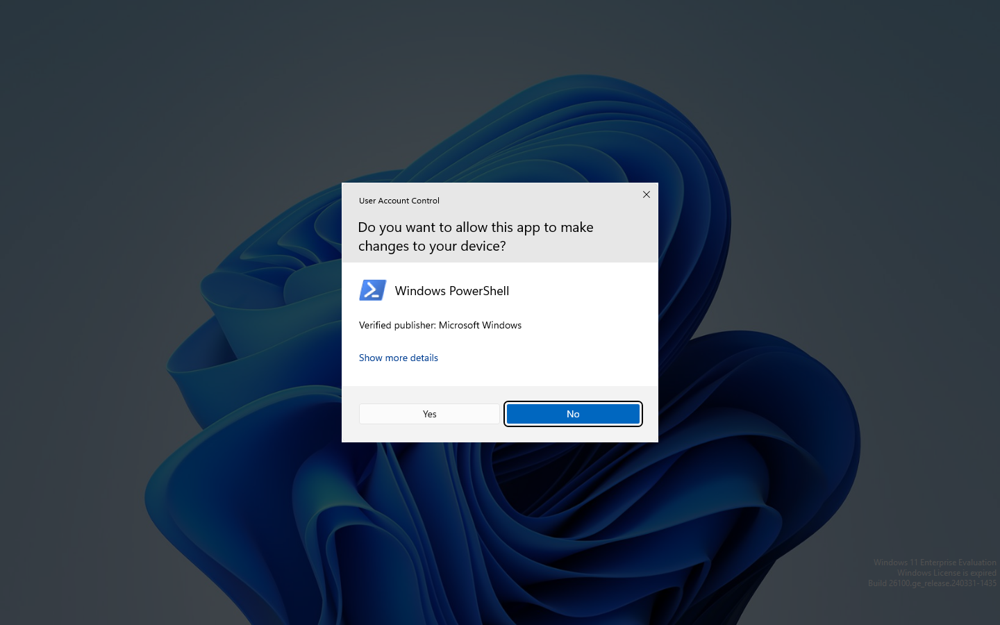
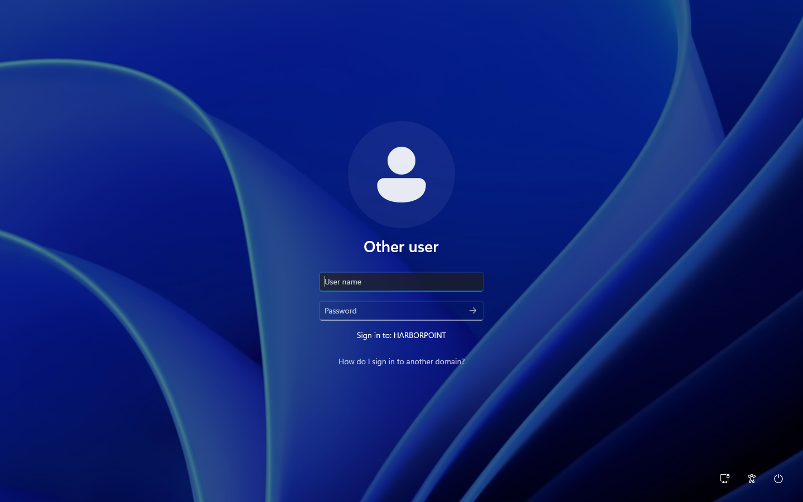
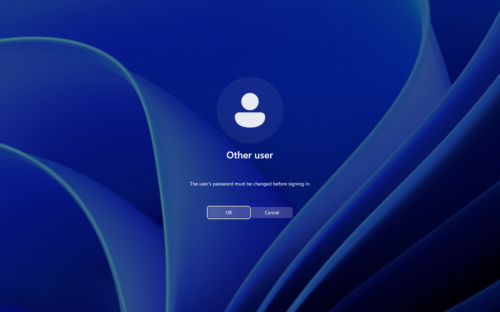
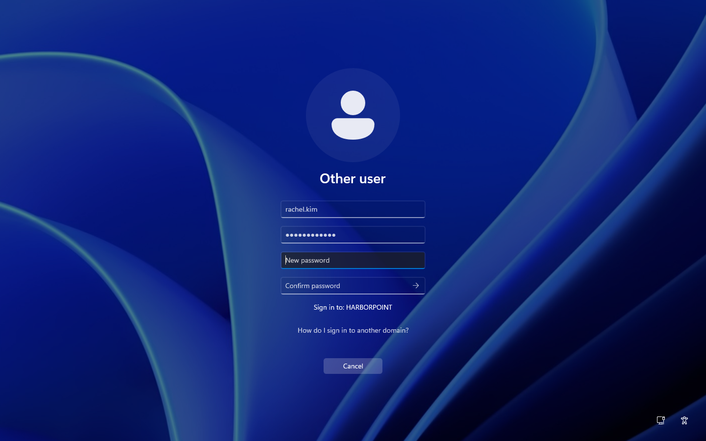
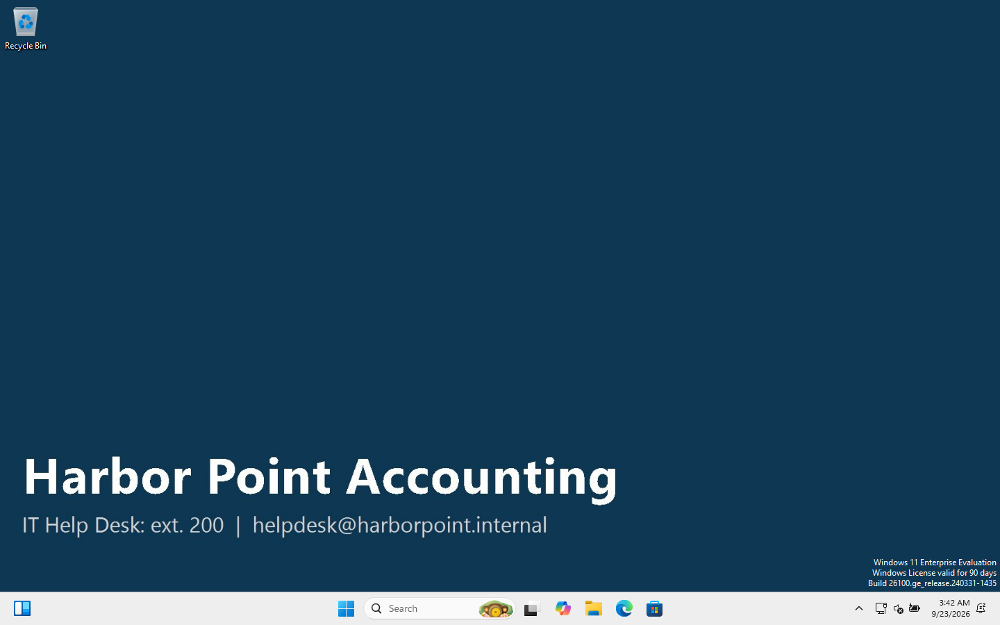

# 08 · Join the Windows 11 client and sign in as an employee

> **Goal:** join WS01 to `harborpoint.internal`, then sign in as Rachel Kim (Sales Manager) and check that everything from docs 04–07 actually reaches her.

## Why a company does this

A PC that isn't domain-joined is invisible to IT: no central logins, no Group Policy, no drive maps. Joining a new PC is one of the most common help desk and desktop support tasks.

## Before you start: the PC must find the DC through DNS

```
PS> Get-DnsClientServerAddress -AddressFamily IPv4      # must show 10.10.10.10
PS> nltest /dsgetdc:harborpoint.internal                  # must find DC01

           DC: \\DC01.harborpoint.internal
      Address: \\10.10.10.10
     Dom Name: harborpoint.internal
The command completed successfully
```

If `nltest` fails, **fix DNS first**. Joining won't work until it does.

## Step 0: Two things that bit me with an evaluation copy of Windows 11

1. **"Windows License is expired" and the PC shut down every hour.** Evaluation copies must **activate online**, and WS01 had no internet because HarborNet had no DHCP yet. Once it had a network: `slmgr /ato` → *Product activated successfully*, and the desktop then showed "valid for 90 days".
2. **Admin commands failed with "Access is denied" even though I was an admin.** That's **UAC** (User Account Control). Admin accounts run with a *filtered* standard-user token until you approve elevation:



> 🎓 UAC is why you **right-click → Run as administrator** for admin tools, even when you're logged in as an admin.

## Step 1: Join the domain

### GUI
1. Press **Win+R** → `sysdm.cpl` → **Change…**
   *(or Settings → Accounts → Access work or school → Connect → "Join this device to a local Active Directory domain")*
2. Select **Member of: Domain** → `harborpoint.internal` → OK.
3. Enter an account that's allowed to join computers (`HARBORPOINT\Administrator`).
4. "Welcome to the harborpoint.internal domain." → restart.

### PowerShell
[`scripts/07-Join-Domain.ps1`](../scripts/07-Join-Domain.ps1):
```powershell
Add-Computer -DomainName harborpoint.internal -Credential HARBORPOINT\Administrator -Restart
```

### Check where the computer account landed
```
PS> Get-ADComputer WS01 | Select DistinguishedName
CN=WS01,OU=Workstations,OU=Computers,OU=HarborPoint,DC=harborpoint,DC=internal
```
It went straight into **Workstations** (thanks to `redircmp` in doc 05), so the Workstation Security GPO applied at the next boot.

## Step 2: What the employee sees at the sign-in screen

The login banner from Group Policy appears first:


Then the sign-in box. It says **"Sign in to: HARBORPOINT"**, and the username box is empty because of the "Don't display last signed-in" policy:



> 💡 To sign in as a *local* account on a domain PC, type `.\username`. To pick the domain explicitly, type `HARBORPOINT\username`.

## Step 3: First sign-in forces a password change

Rachel signs in with her temporary password (`Welcome!2026`, lab-only). Because her account has **"User must change password at next logon"** ticked, Windows stops her:




### ❗ My first new password was rejected, and why

I tried `RachelSales#2026`. It's 16 characters with upper, lower, number and symbol, so it *looks* fine. The domain controller refused:

```
The password does not meet the length, complexity, or history requirement of the domain.
```

**Reason:** the complexity rule also blocks passwords that **contain the user's account name or any part of their full name** (3+ characters). "**Rachel**Sales#2026" contains "Rachel".

This is a real, common help desk call ("it says my password doesn't meet requirements, but it has everything!"). The answer: *don't use your own name in it*.

`Harbor-Blue#2026` was accepted. (In my lab, typing into the VM's sign-in screen remotely kept looping, so I made the same change with `Set-ADAccountPassword -OldPassword … -NewPassword …`, which is exactly what the change-password screen does.)

## Step 4: Rachel's desktop



- ✅ Company wallpaper (HP - Staff Desktop GPO)
- ✅ `P:` Public and `S:` Sales drives (HP - Drive Mappings GPO + item-level targeting)


## Step 5: Verify everything as Rachel


| Check | Result | Proves |
|---|---|---|
| `whoami` | `harborpoint\rachel.kim` | signed in with a domain account |
| `whoami /groups` | `GG_Sales`, `DL_Share_Sales`, `DL_Share_Public` | AGDLP nesting works |
| `gpresult /r /scope:user` | Staff Desktop, Sales USB Block, Drive Mappings | the right user GPOs apply |
| `dir \\DC01\Sales` | lists README.txt | her share works |
| `dir \\DC01\Accounting` | **Access is denied** | NTFS permissions work |
| `regedit` | "Registry editing has been disabled by your administrator" | GPO restriction works |

## Common mistakes

| Symptom | Cause |
|---|---|
| "An Active Directory Domain Controller for the domain could not be contacted" | The PC's DNS isn't pointing at the DC |
| "The trust relationship between this workstation and the primary domain failed" | The computer account's password is out of sync (old snapshot restored, or the account was reset). Fix: `Test-ComputerSecureChannel -Repair`, or rejoin |
| Joined, but no GPOs | Computer is in the `Computers` container, not an OU |
| Password rejected despite looking complex | It contains the user's name, or was used recently (history = 24) |
| Clock more than 5 minutes off | Kerberos errors when joining or signing in |

## Interview questions

- **"Walk me through joining a PC to a domain."** Point DNS at the DC, check you can resolve the domain, join via `sysdm.cpl` or `Add-Computer` with an account that has join rights, reboot, then sign in with a domain account and run `gpresult` to confirm policies.
- **"User says their new password isn't accepted but it's long and complex."** Check the policy: minimum length, complexity (**no parts of their name**), history (can't reuse recent ones), and minimum password age (can't change twice in a day).
- **"How do you check which GPOs applied to a user?"** `gpresult /r`, or `gpresult /h report.html` for the full picture.

⬅️ [07 · Group Policy](07-group-policy.md) | ➡️ [09 · Help desk tickets](09-helpdesk-tickets.md)
