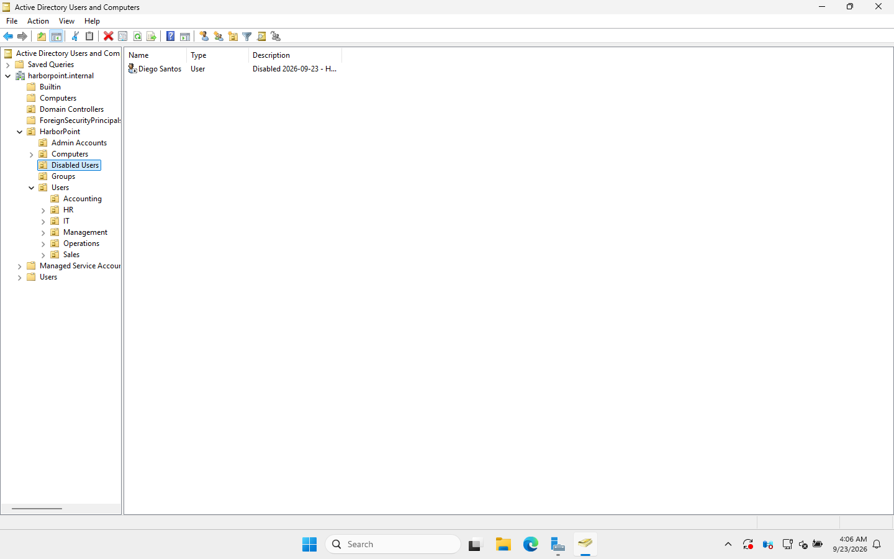

# 09 · Help desk tickets (worked end to end)

> **Goal:** practise the tickets an entry-level help desk actually gets, in the lab, with real output. Each ticket follows the same flow a service desk would expect:
> **Report → Triage questions → Diagnose → Fix → Verify → Ticket notes.**

| # | Ticket | Skills |
|---|---|---|
| HD-1001 | Account locked out | Search-ADAccount, event 4740, delegated unlock |
| HD-1002 | Forgotten password | Password reset, identity check, **a security flaw I found** |
| HD-1003 | New starter | Onboarding script |
| HD-1004 | Leaver | Offboarding script, why we disable rather than delete |
| HD-1005 | Moved department, can't open new share | Group membership, OU move, token refresh |
| HD-1006 | New PC doesn't show the login banner | `gpresult`, OU placement |

All help desk actions are done as **`adm.maya.singh`**, a member of `GG_HelpDesk`, which has only the rights delegated in [doc 05](05-ous-users-groups.md).

---

## HD-1001 · "I can't log in, it says my account is locked"

**Reported by:** Priya Patel (Accounting)
**Triage questions:** Did you recently change your password? Is your phone or another PC still using the old one? Is Caps Lock on?

In the lab I caused a real lockout: six wrong passwords from WS01.
```
attempt 1 : System error 1326 has occurred. The user name or password is incorrect.
...
attempt 5 : System error 1326 has occurred. The user name or password is incorrect.
attempt 6 : System error 1909 has occurred. The referenced account is currently locked out and may not be logged on to.
```
Five bad attempts, then locked: exactly what the Default Domain Policy says.

**Diagnose:**
```
PS> Search-ADAccount -LockedOut
Name        SamAccountName LockedOut
----        -------------- ---------
Priya Patel priya.patel         True

PS> Get-ADUser priya.patel -Properties LockedOut, BadLogonCount, LastBadPasswordAttempt, AccountLockoutTime
LockedOut              : True
BadLogonCount          : 5
LastBadPasswordAttempt : 9/23/2026 3:51:49 AM
AccountLockoutTime     : 9/23/2026 3:51:49 AM
```

**Where did the bad attempts come from?** The DC logs event **4740** with the *caller computer*:
```
LockedUser     : priya.patel
CallerComputer : WS01
```
> 🎓 If a user keeps getting locked out with no typos, 4740 tells you **which device** is sending the old password: often a phone with company email, a mapped drive with saved credentials, or an old RDP session.

**Fix (as the help desk):**
- GUI: ADUC → find Priya → Properties → **Account** tab → tick **Unlock account** → OK.
- PowerShell:
```
PS> Unlock-ADAccount priya.patel -Credential HARBORPOINT\adm.maya.singh
PS> Get-ADUser priya.patel -Properties LockedOut | Select Name, LockedOut
Name      : Priya Patel
LockedOut : False
```

**Least privilege check:** can the help desk account do more than it should?
```
PS> Disable-ADAccount priya.patel -Credential HARBORPOINT\adm.maya.singh
Denied: Insufficient access rights to perform the operation
```
✅ Delegation works as designed.

**Ticket notes:** *Account locked after 5 failed attempts from WS01 at 03:51. Confirmed with user by phone, unlocked. Advised to check saved passwords on phone. Resolved.*

---

## HD-1002 · "I forgot my password"

**Reported by:** Emily Carter (Sales)
**Triage:** **Verify the caller's identity first!** A call-back to the number on file, the manager confirming, or an employee ID. "Password reset for someone pretending to be the user" is one of the most common social-engineering attacks on help desks.

**Fix:** reset to a one-time password and force a change:
```powershell
Set-ADAccountPassword emily.carter -Reset -NewPassword (Read-Host -AsSecureString) -Credential $maya
Set-ADUser emily.carter -ChangePasswordAtLogon $true -Credential $maya
```
```
Name            : Emily Carter
PasswordLastSet :
pwdLastSet      : 0      ← 0 means "must change at next logon"
```
Give the temporary password over the phone, never in the same email as the username.

### 🔥 Security flaw found while testing this ticket

I also checked that the help desk **couldn't** reset an administrator's password:
```
PS> Set-ADAccountPassword adm.ethan.brooks -Reset ... -Credential $maya
Reset (unexpected!)
```
**The help desk could reset a Domain Admin's password.** That means Maya could have logged in as Ethan's admin account and taken over the whole domain.

**Why:** I had created the `adm.*` admin accounts inside `HarborPoint\Users\IT`, which is covered by the help desk's "reset password" delegation. Windows *does* protect Domain Admin accounts through a background process (**AdminSDHolder / SDProp**) that strips inherited permissions, but it runs **every 60 minutes**, and the account was newer than that.

**Fix:** a dedicated OU for admin accounts, outside any help desk delegation:
```
PS> New-ADOrganizationalUnit 'Admin Accounts' -Path 'OU=HarborPoint,DC=harborpoint,DC=internal'
PS> Get-ADUser -Filter "SamAccountName -like 'adm.*'" | Move-ADObject -TargetPath 'OU=Admin Accounts,OU=HarborPoint,...'
PS> Set-ADAccountPassword adm.ethan.brooks -Reset ... -Credential $maya
Denied: Access is denied
```
✅ Fixed, and [script 04](../scripts/04-New-OUs-Groups-Users.ps1) now creates admin accounts in that OU from the start.

> 🎓 **Lesson:** delegation flows down to *everything* in the OU. Keep privileged accounts in their own OU, and test what the help desk *can't* do as well as what it can.

---

## HD-1003 · New starter: Liam Ortiz, Sales Representative, starts Monday

**Requested by:** Rachel Kim (manager). Always get new-starter requests from the manager or HR, never from the new starter.

```powershell
.\Invoke-Onboarding.ps1 -FirstName Liam -LastName Ortiz -Department Sales -Title 'Sales Representative' -Manager rachel.kim
```
```
Username      : HARBORPOINT\liam.ortiz
Email_UPN     : liam.ortiz@harborpoint.internal
Department    : Sales
Groups        : Domain Users, GG_Sales
TempPassword  : Ze4%c$Ny3bKS!UJK        ← random, shown once (lab output)
MustChangePwd : True
```
Because Liam is in `GG_Sales`, he automatically gets the `S:` drive, the Sales share permissions, the USB block and the wallpaper. **Nobody had to touch a folder or a GPO.** That's the payoff of groups and OUs.

**Ticket notes:** *Account created in Sales OU, added to GG_Sales, manager set to Rachel Kim. Temp password given to manager by phone. User must change at first logon.*

---

## HD-1004 · Leaver: Diego Santos, last day today

**Requested by:** HR.

```
PS> Get-ADPrincipalGroupMembership diego.santos      # before
Domain Users
GG_Sales

PS> .\Invoke-Offboarding.ps1 -SamAccountName diego.santos -Ticket HD-1004
Name              : Diego Santos
Enabled           : False
Description       : Disabled 2026-09-23 - HD-1004
DistinguishedName : CN=Diego Santos,OU=Disabled Users,OU=HarborPoint,DC=harborpoint,DC=internal
Groups left       : 0
Group list saved to C:\ITLogs\Offboarding

PS> Get-Content C:\ITLogs\Offboarding\diego.santos-groups-*.csv
"User","Name","DistinguishedName"
"diego.santos","GG_Sales","CN=GG_Sales,OU=Groups,OU=HarborPoint,DC=harborpoint,DC=internal"
```



The script:
1. **Disables** the account (he can't sign in).
2. Sets a **random password** (kills any saved credentials).
3. **Saves his group list** to CSV, in case HR made a mistake and he needs restoring.
4. **Removes all groups** (except Domain Users, the primary group).
5. Stamps the **date + ticket number** in the description.
6. Moves him to **Disabled Users**.

> 🎓 **Why disable instead of delete?** Deleting destroys the account's **SID**. Files he owned, audit logs and permissions would then show an unknown `S-1-5-21-…` instead of his name, and you can't just recreate the account because a new account gets a new SID. Companies disable now and delete after 30–90 days.

---

## HD-1005 · "I moved to Operations but I can't open the Operations share"

**Reported by:** Tom Becker. Moved from Accounting to Operations this week.

**Diagnose:**
```
PS> Get-ADPrincipalGroupMembership tom.becker
Domain Users
GG_Accounting            ← still in his OLD department's group
```

**Fix:** update everything that follows from "department":
```powershell
Remove-ADGroupMember GG_Accounting -Members tom.becker -Confirm:$false   # remove OLD access (important!)
Add-ADGroupMember    GG_Operations -Members tom.becker
Set-ADUser tom.becker -Department Operations -Title 'Operations Coordinator'
Get-ADUser tom.becker | Move-ADObject -TargetPath 'OU=Operations,OU=Users,OU=HarborPoint,DC=harborpoint,DC=internal'
```
```
PS> Get-ADPrincipalGroupMembership tom.becker
Domain Users
GG_Operations

DistinguishedName : CN=Tom Becker,OU=Operations,OU=Users,OU=HarborPoint,DC=harborpoint,DC=internal
```

**Then tell the user to sign out and back in.** Group memberships are baked into the user's access token **at logon**. Until he signs in again, his PC still thinks he's in Accounting. (For network shares, `klist purge` also works without a full sign-out.)

> 🎓 **Don't forget to remove the old access.** Adding without removing is how people end up with access to every department they ever worked in ("privilege creep").

---

## HD-1006 · "The new PC doesn't show the company login message"

**Reported by:** Operations. The new PC doesn't show the "Authorized Use Only" banner that the other PCs have.

To reproduce it, I moved WS01 into the default `Computers` container (where a PC lands if nobody redirected new computers to an OU).

**Diagnose** on the PC:
```
PS> gpupdate /target:computer /force
PS> gpresult /r /scope:computer
    CN=WS01,CN=Computers,DC=harborpoint,DC=internal        ← wrong place
    Applied Group Policy Objects
    -----------------------------
        Default Domain Policy                              ← Workstation Security missing
```
`gpresult` shows **where the computer is** in AD, and that only the domain-level GPO applied. `CN=Computers` is a container, and GPOs can't be linked to it.

**Fix:** move the computer to the right OU:
```powershell
Get-ADComputer WS01 | Move-ADObject -TargetPath 'OU=Workstations,OU=Computers,OU=HarborPoint,DC=harborpoint,DC=internal'
```
**Verify:**
```
PS> gpupdate /target:computer /force
PS> gpresult /r /scope:computer
    CN=WS01,OU=Workstations,OU=Computers,OU=HarborPoint,DC=harborpoint,DC=internal
    Applied Group Policy Objects
    -----------------------------
        HP - Workstation Security                          ← back
        Default Domain Policy
```
**Prevention:** `redircmp "OU=Workstations,OU=Computers,OU=HarborPoint,DC=harborpoint,DC=internal"` so new PCs land in the right place automatically (already in [script 04](../scripts/04-New-OUs-Groups-Users.ps1)).

---

## Help desk habits these tickets taught me

1. **Verify identity** before any password reset or unlock.
2. **Read the actual error message.** "Locked out" (1909) and "wrong password" (1326) need different fixes.
3. **Find the source**: event 4740 names the device causing lockouts.
4. **Least privilege**: test what an account *can't* do, not just what it can.
5. **Group changes need a new logon** before they take effect.
6. **Disable, don't delete**, and keep a record of what was removed.
7. **Write ticket notes** so the next person understands what you did and why.

⬅️ [08 · Windows 11 client](08-join-windows-11-client.md) | ➡️ [10 · PowerShell automation](10-powershell-automation.md)
