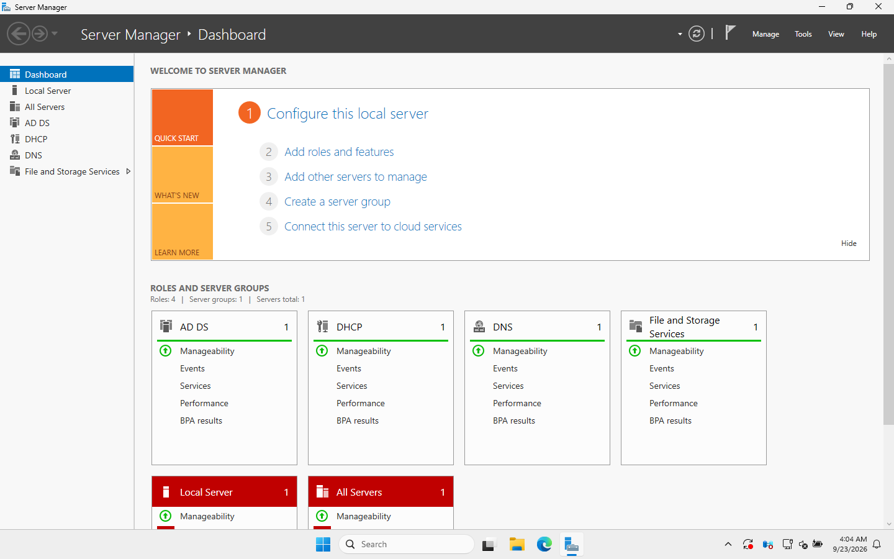

# 11 · Troubleshooting log and lessons learned

> Everything that went wrong while building this lab, how I worked out the cause, and how I fixed it. Honestly, this page taught me more than the parts that worked first time.

## Troubleshooting log

| # | Symptom | Cause | Fix | Doc |
|---|---|---|---|---|
| 1 | New DC stuck on **"Applying computer settings"** for 15+ min after promotion | DFS Replication couldn't reach a DC at first boot (event 1202), so **SYSVOL was never initialised** (`SysvolReady = 0`) and the DC didn't advertise itself | `Restart-Service DFSR` → event 4602, SYSVOL shared, logon completed | [03](03-promote-domain-controller.md) |
| 2 | DC clock **9 minutes** behind | First DC had no reliable external time source | `w32tm /config /manualpeerlist:... /reliable:yes`, resync | [04](04-dns-and-dhcp.md) |
| 3 | Windows 11 said **"Windows License is expired"** and shut down every hour | Evaluation edition couldn't activate: no internet before DHCP existed | Gave it network access, `slmgr /ato` | [08](08-join-windows-11-client.md) |
| 4 | "Access is denied" running admin commands as an admin on Windows 11 | **UAC** filtered token | Run elevated (UAC prompt) | [08](08-join-windows-11-client.md) |
| 5 | New password **rejected** although long and complex | Complexity rule forbids **parts of the user's name** ("**Rachel**Sales#2026") | Chose a password without the name | [08](08-join-windows-11-client.md) |
| 6 | **Help desk could reset a Domain Admin's password** | Admin accounts sat in an OU covered by help desk delegation. AdminSDHolder only runs every 60 min | Moved `adm.*` accounts to their own OU, re-tested → Access denied | [09](09-helpdesk-tickets.md) |
| 7 | Server Manager tiles all **red ("Manageability")** | A **restart was pending** after role installs and updates (`Restart required: true` in the ServerManager event log) | Rebooted DC01 → all green | below |
| 8 | Expected Access-Based Enumeration to hide other departments' shares; it didn't | ABE hides items **inside** a share, not share names | Corrected my understanding and docs | [06](06-file-shares-permissions.md) |
| 9 | PC in `CN=Computers` got no OU GPOs (reproduced on purpose) | Containers can't have GPOs linked | Move to the Workstations OU, `redircmp` | [09](09-helpdesk-tickets.md) |

### DC01 after all fixes

`dcdiag /q` after a clean reboot only reported:
- **DFSREvent**: it flags DFSR error events from the last 24 hours, i.e. the first-boot problem in row 1 above. SYSVOL has been fine since the fix.
- **SystemLog**: a DCOM error about Windows Update during shutdown, and a KDC event 7 with a *blank* account name. Logins and Kerberos work normally. I noted it but haven't found a confirmed cause yet. It's on my list to research rather than guess about.

## My troubleshooting method (what actually worked)

1. **Read the exact error text or code.** 1326 vs 1909, `C0000224`, event IDs 1202 / 4602 / 4740. The code usually tells you where to look.
2. **Check the basics in order:** network → DNS → time → service running → permissions.
3. **Test from the other side.** When DC01's screen was frozen, I tested it *from WS01* (ping, ports 53/88/389, DNS SRV lookup) and remotely. That's how I knew AD was running but SYSVOL wasn't.
4. **Change one thing at a time**, then re-test.
5. **Write it down** in the table above.

## Useful commands I now know by heart

| Command | Use |
|---|---|
| `ipconfig /all` | IP, gateway, **DNS server**, DHCP server, lease |
| `nslookup dc01` / `Resolve-DnsName` | Does DNS work? |
| `nltest /dsgetdc:harborpoint.internal` | Can this PC find a DC? |
| `Test-NetConnection 10.10.10.10 -Port 389` | Is a service port open? |
| `gpupdate /force`, `gpresult /r` | Refresh and check Group Policy |
| `whoami /groups` | What groups is my token actually using? |
| `dcdiag /q` | DC health check (silent = good) |
| `w32tm /query /status` | Time source and last sync |
| `Search-ADAccount -LockedOut` | Who's locked out? |
| `Get-WinEvent -FilterHashtable @{LogName='Security';Id=4740}` | Where did a lockout come from? |
| `klist purge` | Drop Kerberos tickets so new group memberships apply |

## Lessons learned

1. **DNS is everything in AD.** Every PC must use the DC for DNS.
2. **Time matters.** More than 5 minutes of clock difference and Kerberos fails.
3. **OU placement decides Group Policy.** Check with `gpresult`, which shows where the object lives.
4. **Groups, not users,** get permissions (AGDLP). Staff changes become group changes.
5. **Least privilege has to be tested.** Delegation reaches *everything* below the OU, which is how I nearly gave the help desk the keys to the domain.
6. **Disable, don't delete** leavers.
7. **Evaluation software has catches.** Activation, expiry dates, rearms.
8. **I was wrong about ABE**, and testing is how I found out. Don't document what you *expect*; document what you *observed*.

## What I'd add next

- A **second domain controller** (redundancy, replication, FSMO roles).
- A separate **file server** instead of shares on the DC.
- **Fine-Grained Password Policy** with stricter rules for admin accounts.
- **LAPS** (Local Administrator Password Solution) so every PC's local admin password is unique.
- **Windows Server Backup** plus the **AD Recycle Bin**, and practising a restore.
- Hybrid identity with **Entra ID Connect** (Microsoft 365).

## Lab tooling notes (not part of the AD skills)

I built this lab by driving VirtualBox from the host with `VBoxManage`: unattended installs, `guestcontrol` to run PowerShell inside the VMs, and `controlvm screenshotpng` for the screenshots. A few quirks for anyone rebuilding it the same way:
- Guest commands on Windows 11 run with a UAC-filtered token, so I enabled WS01's built-in Administrator (which isn't filtered) for lab automation. **Don't do this on a real PC.**
- Headless VMs sometimes return a **stale screenshot**. Briefly changing the resolution (`setvideomodehint`) forces a redraw.
- VirtualBox's unattended install sets up **auto-logon**. I turned it off on WS01 once it joined the domain.

⬅️ [10 · PowerShell automation](10-powershell-automation.md) | 🏠 [README](../README.md)
